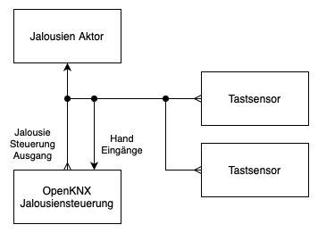
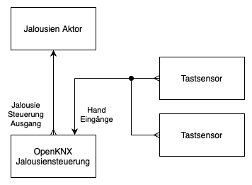

# Applikationsbeschreibung Jalousiensteuerung 

Die Jalousiensteuerung bietet unterschiedliche Betriebsarten.
Jede Betriebsart kann durch Ereignisse, Eingangs- oder Messwerte zulässig sein. 
Sind mehrere Betriebsarten zulässig, entscheidet die Priorität über die Auswahl.

## Betriebsarten

Folgende Betriebsarten - gereiht nach der Priorät - stehen zur Verfügung:

### Bereitschaft (Priorität 7 - niedrigste)

In dieser Betriebsart ist die Steuerung im Leerlauf und wartet auf Ereignisse die eine Wechsel der Betriebsart bewirken.

### Beschattung 1 (Priorität 6)

Dieser Modus steht nur zur Verfügung, wenn in der Kanaleinstellung unter "Modus Auswahl" **Beschattungsmodus Anzahl** mindestens 1 eingestellt wurde.

### Beschattung 2 (Priorität 5)

Dieser Modus steht nur zur Verfügung, wenn in der Kanaleinstellung unter "Modus Auswahl" **Beschattungsmodus Anzahl** 2 eingestellt wurde.

### Nachtmodus (Priorität 4)

Dieser Modus steht nur zur Verfügung, wenn in der Kanaleinstellung unter "Modus Auswahl" **Nachtmodus** aktiviert wurde.

Achtung: Wenn kein automatisches Ende konfiguriert ist, muss der Nachtmodus durch Handbetrieb oder durch AUS am Eingang `Nachtmodus Aus-/Einschalten` deaktiviert werden, damit eine Beschattung stattfindet kann.

### Handbetrieb (Priorität 3)

In diese Betriebsart wird gewechselt, sobald eine Handbedienung über einen der Eingänge erkannt wird:

- `Handbetrieb Auf/Ab`
- `Handbetrieb Stopp/Schritt`
- `Handbetrieb Prozent`
- `Handbetrieb Lamelle Prozent` 

zusätzlich kann der Handbetrieb über den Eingang 

`Handbetrieb Aus-/Einschalten` 

manuell aktiviert bzw. deaktiviert werden.

### Fenster gekippt (Priorität 2)

Dieser Modus ist nur verfügbar, wenn 2 Fensterkontakte zur Verfügung stehen.
Der Modus kann in den meisten Betriebsartenkonfiguriationen gesperrt werden.

### Fenster offen (Priorität 1 - Höchste)

Dieser Modus ist nur verfügbar, wenn mindestens ein Fensterkontakte zur Verfügung stehen.
Der Modus kann in den meisten Betriebsartenkonfiguriationen gesperrt werden.

## Diagnose

Die meisten Betriebsarten bieten einen Ausgang der über die aktuelle Aktivierung der Betriebsart informiert. 

Zusätzlich steht ein Ausgang zur Verfügung, der die Betriebsart als Szenennummer ausgibt:

`Aktiver Modus`

Verwendete Szenennummer:

1=Beschattung 1  
2=Beschattung 2  
3=Beschattung 3  
4=Beschattung 4  
10=Bereit  
11=Handbetrieb  
12=Nacht  
13=Fenster Kippstellung  
14=Fenster Geöffnet  

Hinweis: Die Szenenummer wird auf dem KNX Bus beginnend mit 0 abgebildet. 
Szene 1 ist am Bus also 0. 
Bei machen Smart-Home Systemen (Z.B. OpenHAB) muss auf Bus-Wert abgefragt werden.

## Wichtige Informationen zur richtigen Konfiguration der Gruppenadressen

Die richtige Konfiguration ist abhängig von der Betriebart. Bitte daher die Hinweise im Kapitel [Handbetriebseinstellung](#handbetriebseinstellung) beachten.

# Applikationsprogram

<!-- DOC -->
## Allgemein

(c) OpenKNX, Michael Geramb 2024

Die vollständige Anwendungsbeschreibung ist im Web unter https://github.com/OpenKNX/OFM-ShutterControllerModule/blob/v1/doc/Applikationsbeschreibung-ShutterController.md zu finden.

Insbesondere im Bereich Handbedienung sind wichtige Informationen zur richtigen Verbindung der Gruppenadresse im Kapitel "Handbetriebseinstellung" zu finden. 

### WARNUNG und Sicherheitshweis:

Die Jalousiensteuerung darf aus Sicherheitsgründen nicht bei Beschattungseinrichtungen bei Notausgängen verwendet werden, da eine Automatik im Notfall das Öffnen verhindern könnte.

<!-- DOC -->
### Verfügbare Kanäle

Über diese Auswahl werden die Anzahl der benötigten Steuerkanäle festgelegt.

<!-- DOC -->
### Globale Beschattungseinstellung

<!-- DOC -->
#### Tägliche Aktivierung

Legt fest, ob eine deaktivierte Beschattungsautomatik am nächsten Tag wieder aktiviert werden soll.

- **AUS**  
  Es erfolgt keine automatische aktivierung der Beschattungsautomatik

- **EIN**  
  Es wird täglich um Mitternacht die Beschattungsautomatik eingeschalten

- **Über KO, Standard AUS**  
  Es wird nach dem Start die Beschattungsautomatik nicht täglich reaktivert.
  Die Funktion kann jedoch über ein Kommunikationsobjekt eing- bzw. ausgeschalten werden.

- **Über KO, Standard EIN**  
  Es wird nach dem Start die Beschattungsautomatik täglich reaktivert.
  Die Funktion kann jedoch über ein Kommunikationsobjekt ein- bzw. ausgeschalten werden.

- **Über KO, Standard AUS, initial vom Bus lesen**  
  Es wird nach dem Start die Beschattungsautomatik nicht täglich reaktivert.
  Die Funktion kann jedoch über ein Kommunikationsobjekt eing- bzw. ausgeschalten werden.
  Nach dem Gerätestart wird ein Lesetelegram für das Kommunikationsobjekt auf dem Bus gesendet.

- **Über KO, Standard EIN, initial vom Bus lesen**  
  Es wird nach dem Start die Beschattungsautomatik täglich reaktivert.
  Die Funktion kann jedoch über ein Kommunikationsobjekt ein- bzw. ausgeschalten werden.
  Nach dem Gerätestart wird ein Lesetelegram für das Kommunikationsobjekt auf dem Bus gesendet.

<!-- DOC -->
### Verfügbare Messwerteingänge
Verschiedene Messwerte können benutzt werden, um eine automatische Beschattung zu ermöglichen oder zu verhindern.
In diesem Abschnitt wird gewählt, welche Messwerte in der KNX-Anlage zur Verfügung stehen und zur Steuerung verwenden werden sollen.

<!-- DOC -->
### Messwertüberwachung
Die Messwertüberwachung wird verwendet um bei Ausfall eines Messwertes einen Notbetrieb zu Ermöglichen.

<!-- DOC -->
#### Ausfallsüberwachung
Die Ausfallüberwachung legt fest wie lange auf einem Messwert gewartet wird.
Empängt die Steuerung innerhalb der Zeitspannen keinen Wert, wird in den Notfallbetrieb gewechselt.

<!-- DOC -->
#### Verhalten bei Ausfall
Über diese Auswahl wird festgelegt, wie der Notfallbetrieb den fehlenden Messwert behandeln soll.
Wird innerhalb des Notbetriebes der fehlende Wert empfangen, wird der Notbetrieb automatisch beendet.

- **Wert ignorieren**  
Der Messwert wird bei der Bestimmung ob eine Beschattung zulässig ist nicht mehr berücksichtigt.

- **Leseanforderung schicken, dann ignorieren**  
Es wird einmalig ein Lesetelegram für den Messwert auf den Bus gesandt, erfolgt weiterhin keine Messwertübertragung wird der Wert bei der Bestimmung ob eine Beschattung zulässig ist nicht mehr berücksichtigt.

- **Fixen Wert vorgeben**  
Ein in der Konfiguration fest eingestellter Wert erstetzt den fehlenden Messwert.
Diese Einstellung wird empfohlen, wenn der Messwert entscheidend ist, welcher Beschattungsmodus aktiv werden soll. 
Über die geignet Wert-Vorgabe kann somit ein Modus bevorzugt werden.

- **Leseanforderung schicken, dann fixen Wert vorgeben**  
Diese Einstellung verhält sich gleich wie vorherige, jedoch wird zuerst einmal ein Lesetelegram für den Messwert auf den Bus gesandt. Erfolgt weiterhin keine Messwertübertragung wird der eingetragen Wert anstatt des Messwertes verwendet.

<!-- DOC -->
#### Wert

Der Wert der im Fehlerfall anstatt des Messwertes verwendet werden soll.
Zu beachten bei der Wahl des Wertes ist, dass dieser je nach Konfiguration entscheidend für die Auswahl des Beschattungsmodus sein kann.

<!-- DOC -->
### Messwerte

Es können verschiedene Messwerte für die automatische Beschattung verwendet werden.

<!-- DOC -->
#### Temperatur

Für den Temperatureingang sollte ein Außentemperatur-Fühler verwendet werden.

<!-- DOC -->
#### Temperatur Prognose

Dieser Eingang eignet sich für die prognostizierte Temperatur eines Wetterdienstes. 

<!-- DOC Skip="1" -->
Es kann hierfür z.B. die OpenKNX-Firmware [OAM-InternetServices](https://github.com/OpenKNX/OAM-InternetServices) mit dem [OFM-InternetWeatherModule](https://github.com/OpenKNX/OFM-InternetWeatherModule) verwendet werden.
<!-- DOCCONTENT
Es kann hierfür z.B. die OpenKNX-Firmware OAM-InternetServices mit dem OFM-InternetWeatherModule verwendet werden.
DOCCONTENT -->

<!-- DOC -->
#### Helligkeit

Vorgesehen für den Helligkeitswert einer KNX-Wetterstation.

<!-- DOC -->
#### UV-Index

Dieser Eingang eignet sich für den UV-Index eines Wetterdienstes.

<!-- DOC Skip="1" -->
Es kann hierfür z.B. die OpenKNX-Firmware [OAM-InternetServices](https://github.com/OpenKNX/OAM-InternetServices) mit dem [OFM-InternetWeatherModule](https://github.com/OpenKNX/OFM-InternetWeatherModule) verwendet werden.
<!-- DOCCONTENT
Es kann hierfür z.B. die OpenKNX-Firmware OAM-InternetServices mit dem OFM-InternetWeatherModule verwendet werden.
DOCCONTENT -->

<!-- DOC -->
#### Regen

Vorgesehen für den Regen-Indikator einer KNX-Wetterstation.

<!-- DOC -->
#### Wolkenbedeckung

Der Bedeckungsgrad durch Wolken in Prozent von einem Wetterdienst.

<!-- DOC Skip="1" -->
Es kann hierfür z.B. die OpenKNX-Firmware [OAM-InternetServices](https://github.com/OpenKNX/OAM-InternetServices) mit dem [OFM-InternetWeatherModule](https://github.com/OpenKNX/OFM-InternetWeatherModule) verwendet werden.
<!-- DOCCONTENT
Es kann hierfür z.B. die OpenKNX-Firmware OAM-InternetServices mit dem OFM-InternetWeatherModule verwendet werden.
DOCCONTENT -->

<!-- DOC HelpContext="Kanal" -->
## Kanal 1-n

Auf dieser Seite werden die verschiedenen Betriebsarten der Jalousiensteuerung festgelegt.

<!-- DOC -->
#### Bezeichnung

Die Bezeichnung wird innerhalb der ETS verwenden um den Kanal und die Kanalobjekte zu benennen.
Es wird empfohlen, die Bezeichnung des Raumes oder der Jalousie zu verwenden.
Z.B. Küche, Wohnzimmer Süden, Wohnzimmer Terassentür, Schlafzimmer...

<!-- DOC -->
#### Geräteart

Die Art der Beschattungseinrichtung:

- **Kanal deaktiviert**  
Diese Einstellung soll verwendet werden wenn der Kanal nicht benötigt wird. 
Achtung, alle Gruppenaddressen Verbindungen des Kanals gehen verloren, die Einstellungen bleiben jedoch Erhalten und können werden bei der Wiederaktivierung verwendet.

- **Jalousie**  
Erlaubt eine Positionsvorgabe und Lamellensteuerung.

- **Rollo**  
Erlaubt eine Positionsvorgabe.
Es steht keine Lamellensteuerung zur Verfügung.

<!-- DOC -->
#### Kanal deaktivieren (zu Testzwecken)

Mit dieser Einstellung kann ein Kanal deaktiviert werden, ohne das die Konfigurationswerte und Gruppenadressen an den Kommunikationsobjekten verloren gehen.
Ein deaktivierter Kanal sendet keine Telegramme auf dem KNX-Bus. 

<!-- DOC -->
### Modus Auswahl

<!-- DOC -->
#### Nachtmodus

Über den Nachtmodus kann die Jalousie oder der Rolladen am Abend automatisch geschlossen und in der Früh geöffnet werden.

<!-- DOC -->
#### Fenster offen

Fenster können einen oder zwei Kontakte zur Verfügung stellen. 
Bei zwei Kontakten kann zwischen Kippstellung und vollständiger Fensteröffnung unterschieden werden und die Steuerung der Jalousie unterschiedlich erfolgen. 
Z.B. kann bei der Kippstellung einer Terrassentüre die Lamelle in die Waagrechte Position gebracht werden um einen optimales Luftzug zu ermöglichen während bei der vollständigen Öffnung die Jalousie hochgefahren werden um den Durchgang zu ermöglichen.

<!-- DOC -->
#### Beschattungsmodus Anzahl

Die Steuerung ermöglicht unterschiedliche Beschattungen abhängig von Messwerten.
Beispielsweise könnnen bei Hitzetagen die Jalousienlamellen geschlossen werden um die Hitze bestmöglich abzuschirmen während bei mäßig warmen Tagen die Lamellen an den Sonnenstand angepasst werden um das Tageslicht in den Raum zu lassen.

<!-- DOC -->
### Beschattungseinstellungen

<!-- DOC -->
#### Beschattung nach Handbetrieb unterbrechen

Mit dieser Einstellung wird festgelegt, wie lange die Beschattung nach dem Handbetrieb unterbrochen wird. 
Bei einer Unterbrechung wird das Kommunikationsobjekt "Beschattung Eingeschaltet" auf AUS gesetzt. Mit einem EIN Befehl auf das Kommunikationsobjekt "Beschattung Einschalten" kann die Beschattung jederzeit wieder manuell aktiviert werden.

Für die automatische reaktiverung stehen folgende Einstellungen bereit:

- für diese Periode deaktivieren  
  Bei dieser Einstellung wird für die Beschattungsperiode die sich aus den konfigurierten Sonnenstandsgrenzen ergibt, deaktivert.

- Zeiten von 1 Minute bis zu 12h  
  Achtung, wird diese Zeit sehr kurz gewählt, wird die Jalousie nach einer manuellen Öffnung sehr schnell wieder in die Beschattungsposition gefahren. Es wird daher emfohlen eine Zeit von mindenstens 30 Minuten zu verwenden. 

<!-- DOC -->
#### Nach Beschattung

Diese Einstellung legt fest, was am Ende der Beschattung passieren soll.

- Keine Änderung  
  Die Jalousie bleibt in der letzten Beschattungseinstellung

- Position vor Beschattungsstart
  Die Position und bei Jalousien auch die Lamellenstellung die zuletzt vor der Beschattung verwendet wurde, wird wieder hergestellt.
  Damit die Jalousiensteuerung die Jalousienposition vor der Beschattung richtig bestimmen kann, ist wichtig, dass alle Handeingänge mit den richtigen Gruppeneingängen verbunden werden. 
  Achtung: Bei Jalousienbedienung über Szenen des Aktors kann die Jalousiensteuerung die richtige Position nicht zuverlässig erkennen. 
  In diesem Fall wird dieser Modus nicht empfohlen.

- Fährt Auf
  Die Jalousie wird vollständig geöffnet.

- Lamelle Waagrecht (Einstellung nur bei Geräteart 'Jalousie' vorhanden)  
  Die Jalousie bleibt in der Position der Beschattung, jedoch wird die Lamelle waagrecht (50%) gestellt.

<!-- DOC -->
### Raumbezogene Messwert Eingänge

Auch Messwerte des Raums der Beschattet wird, können für die Entscheidung ob Beschattet werden soll oder nicht heranzgeogen werden.

<!-- DOC -->
#### Heizung

In dieser Einstellung kann festgelegt werden ob die Heizung als Messgröße verwendet wird.
Diese Einstellung ist Sinnvoll um eine Beschattung während der Heizperiode zu unterbinden.
Dabei kann der festgelegt werden, ob am KNX-Bus lediglich die Heizanforderung als Gruppenadresse zur Verfügung steht oder die aktuelle Stellgröße des Heizungsaktors.

<!-- DOC -->
#### Raumtemperatur

Die Raumtemperatur kann verwendet werden um bei zu niedriger Raumtemperatur die Beschattung zu sperren damit die Sonneneinstrahlung als natürliche Wärmequelle benutzen wird.

<!-- DOC -->
## Handbetrieb

In diesem Abschnitt wird die Konfiguration für die manuelle Steuerung der Jalousie bzw. des Rolladen vorgenommen.

Achtung: die manuelle Steuerung kann je nach Einstellung von 'Handbetriebseinstellung' im Nacht-, Fenster Offen-, Beschattungsmodus deaktivert werden.

<!-- DOC -->
### Handbetriebseinstellung

In diesem Abschnitt werden Optionen festgelegt, wie die Steuerung sich im Fall einer Handbedienung verhalten soll.

#### Anschluss der Gruppenadressen

Abhängig davon, ob die Handbedienung über den Aktor oder über die OpenKNX Jalousiensteuerung erfolgen soll, müssen die Gruppenadressen unterschiedlich verbunden werden.
**Wichtig** Unabhängig vom Modus müssen alle Gruppenadressen die für die Handsteuerung verwendet werden an die entsprechenden Handbedienungseingänge der OpenKNX Jalousiensteuerung verbunden werden.

#### Manuelle Bedienung über den Aktor

<!-- DOC Skip="1" -->
  
In dieser Einstellung erfolgt die Bedienung im Handbetrieb weiterhin direkt über den Aktor.
Diese Einstellung bietet eine erhöhte Betriebssicherheit, da bei einem Ausfall der Steuerung die Bedienung weiterhin gewährleistet ist.
Jedoch steht die Möglichkeit der Sperre der Handbedienung in diesem Modus nicht zur Verfügung.

#### Manuelle Bedienung über die OpenKNX Jalousiensteuerung ("Modul sendet AUF/AB zum Aktor" und "Modul sendet 0/100% zum Aktor")

<!-- DOC Skip="1" -->
  
In dieser Einstellung werden getrennte Gruppenadressen für die Verbindung zwischen Steuerung und Aktor benötigt. Die Jalousienaktor Ansteuerung erfolgt ausschließlich über die Steuerung, die bei Bedarf Befehle von den Tastsensoren weiterleitet.
Der Vorteil dieser Einstellung ist, das die Bedienung über die Tasten durch die Steuerung unterbunden werden kann.

Für die Ansteuerung des Aktors stehen die beiden Einstellung "Modul sendet AUF/AB zum Aktor" und "Modul sendet 0/100% zum Aktor" zur Verfügung. 
Welche der beiden Einstellungen verwendet werden soll, hängt dabei vom jeweiligen Jalousienaktor ab und es muss getestet werden, welche das bessere Ergebniss liefert. 
Empfohlen wird mit der Einstellung "Modul sendet 0/100% zum Aktor" zu beginnen, da diese Einstellung der OpenKNX Jalousien Steuerung mehr Kontrolle über den Aktor bietet.

##### Modul sendet AUF/AB zum Aktor

In dieser Konfiguration muss eine eigene Gruppenadresse zur Verbindung der Jalousiensteuerung mit dem Aktor für das AUF/AB Telegram das am Kommunikationsobjekt "Auf/Ab Ausgang" gesendet wird, konfiguriert werden. 
Jeder manuelle Bedienung über das Kommunikationsobjekt "Handbetrieb Auf/Ab" wird and den Ausgang weitergeleitet, so eine Bedienung über Hand aktuell zulässig ist.

##### Modul sendet 0/100% zum Aktor

In dieser Konfiguration werden Eingangs-Telegramme an den Kommunikationsobjekten "Handbetrieb Auf/Ab" auf Ausgangstelegramme an den Kommunikationsobjekten "Jalousie Prozent Ausgang" umgesetzt.

<!-- DOC -->
#### Erstes manuelles AUF ignorieren, wenn bei Beschattungstart geschlossen

Dieser Einstellung soll verwendet werden ein Taster zum gleichzeitig Öffnen von mehrere Jalousien verwendet wird, diese aber nicht alle die Beschattung benutzen.
In diesem Fall verhindert die Einstellung, dass bei aktiver Beschattung die Jalousie sich mit öffnet.
Jalousien ohne aktiver Beschattung werden aber weiterhin normal geöffnet.

Bei Handbedienungseinstellung "Manuelle Bedienung über Aktor" wird zum ignorieren des manuellen Befehls über das Kommunikationsobjekt "Stopp/Schritt Ausgang" ein Stopp gesendet. Es kann dabei trotzdem zu einer minimalen Bewegung oder einem Geräusch der Jalousie kommen. In den beiden anderen Handbedienungseinstellung "Modul sendet AUF/AB zum Aktor" und "Modul sendet 0/100% zum Aktor" tritt dieser Effekt nicht auf, da in diesem Fall der Aktor keinen Fahrbefehl erhält.

<!-- DOC -->
#### Handbedienung bei globaler Kanal-Sperre erlauben 
Diese Option ist nicht verfügbar wenn "Manuelle Bedienung über den Aktor" unter "Handbetriebseinstellung" gewählt wurde.

Mit diese Einstellung wird festgelegt, ob eine Handsteuerung bei aktiver Sperre am Kommunikationsobjekt "Sperre" des Kanals zugelassen ist.

<!-- DOC -->
#### Sperrzeit für Automatiken nach Handbedienung

Innerhalb der eingestellten Zeit wird ein Beschattungsstart oder der Nachtmodus verhindert.

<!-- DOC -->
### Sonderfunktionen Tasterbediendung

Die OpenKNX Jalousiensteuerung kann Fahrbefehle die normalerweise keine Auswirkung auf die Jalousie haben für Steuerbefehle benutzen.

<!-- DOC -->
### Zusätzliches Kommunikationsobjekt-ohne-Sonderfunktion-Auswertung

Über diese Option kann ein weiteres Kommunikationsobjekt für 'Handbetrieb Steuerung Auf/Ab (ohne Sonderfunktion)' eingeblendet werden, an dem keine Auswertung der Sonderfunktionen erfolgt. 

Beispiel Anwendung:
Es gibt einen Taster der nur die betreffende Jalousie steuert und einen anderen Taster der mehrere Jalousien gleichzeitig bedient. Wenn nun die Sonderfunktion nur am ersten Taster der nur die betreffende Jalousie steuern soll verfügbar sein soll, muss für den zweiten Taster mit der Gruppensteuerung eine eigene Gruppenadresse angelegt werden und mit dem Kommunkiationsobject 'Handbetrieb Steuerung Auf/Ab (ohne Sonderfunktion)' verbunden werden.

<!-- DOC -->
### Kurzer Druck 'Nach oben'

Ist die Jalousie in der vollständig geöffneten Stellung (0%) und wird ein Eingangstelegram am Kommunikationsobjekt "Handbetrieb Stopp/Schritt" für AUF empfangen, kann dieses für folgende Funktionen benutzt werden:

- Beschattungsautomatik EIN/AUS

Die Beschattungsautomatik wird je nach vorherigem Zustand Aus, bzw. Eingeschalten. 
Damit kann mit den normalen Jalousientaster die Beschattungsautomatik mit einem kurzen Druck gesteuert werden. 
Die Einstellung ist nur sinnvoll Nutzbar wenn die Jalousiensteuerung über 2 Tasten erfolgt.

- Beschattungsautomatik EIN

Die Beschattungsautomatik wird eingeschalten. 
Damit kann mit den normalen Jalousientaster die Beschattungsautomatik mit einem kurzen Druck eingeschalten werden. 
Die Einstellung ist nur sinnvoll Nutzbar wenn die Jalousiensteuerung über 2 Tasten erfolgt.

- Beschattungsautomatik AUS

Die Beschattungsautomatik wird ausgeschalten. 
Damit kann mit den normalen Jalousientaster die Beschattungsautomatik mit einem kurzen Druck ausgeschalten werden. 
Die Einstellung ist nur sinnvoll Nutzbar wenn die Jalousiensteuerung über 2 Tasten erfolgt.

- Jalousien schließen

Ist diese Einstellung aktiv, kann bei einer 2 Tastenbedienung auch mit einem kurzen Tastendruck die Jalousie geschlossen werden. Dazu muss lediglich der "Auf" Knopf bei vollständig geöffneter Jalousie kurz betätigt werden.

<!-- DOC -->
### Langer Druck 'Nach oben'

Ist die Jalousie in der vollständig geöffneten Stellung (0%) und wird ein Eingangstelegram am Kommunikationsobjekt "Handbetrieb Auf/Ab" für AUF empfangen, kann dieses für folgende Funktionen benutzt werden:

- Beschattungsautomatik EIN/AUS

Die Beschattungsautomatik wird je nach vorherigem Zustand Aus, bzw. Eingeschalten. 
Damit kann mit den normalen Jalousientaster die Beschattungsautomatik mit einem langen Druck gesteuert werden. 
Die Einstellung ist nur sinnvoll Nutzbar wenn die Jalousiensteuerung über 2 Tasten erfolgt.

- Beschattungsautomatik EIN

Die Beschattungsautomatik wird eingeschalten. 
Damit kann mit den normalen Jalousientaster die Beschattungsautomatik mit einem langen Druck eingeschalten werden. 
Die Einstellung ist nur sinnvoll Nutzbar wenn die Jalousiensteuerung über 2 Tasten erfolgt.

- Beschattungsautomatik AUS

Die Beschattungsautomatik wird ausgeschalten. 
Damit kann mit den normalen Jalousientaster die Beschattungsautomatik mit einem langen Druck ausgeschalten werden. 
Die Einstellung ist nur sinnvoll Nutzbar wenn die Jalousiensteuerung über 2 Tasten erfolgt.

- Jalousien schließen

Ist diese Einstellung aktiv, kann bei einer 2 Tastenbedienung auch mit einem langen Tastendruck nach oben die Jalousie geschlossen werden. Somit ist egal, ob der AUF oder AB Knopf lange betätigt wird, die Jalousie schließt sich in beiden Fällen.

<!-- DOC -->
### Kurzer Druck 'Nach unten'

Ist die Jalousie in der vollständig geschlossener Stellung (100%) und wird ein Eingangstelegram am Kommunikationsobjekt "Handbetrieb Stopp/Schritt" für AB empfangen, kann dieses für folgende Funktionen benutzt werden:

- Beschattungsautomatik EIN/AUS

Die Beschattungsautomatik wird je nach vorherigem Zustand Aus, bzw. Eingeschalten. 
Damit kann mit den normalen Jalousientaster die Beschattungsautomatik mit einem kurzen Druck gesteuert werden. 
Die Einstellung ist nur sinnvoll Nutzbar wenn die Jalousiensteuerung über 2 Tasten erfolgt.

- Beschattungsautomatik EIN

Die Beschattungsautomatik wird eingeschalten. 
Damit kann mit den normalen Jalousientaster die Beschattungsautomatik mit einem kurzen Druck eingeschalten werden. 
Die Einstellung ist nur sinnvoll Nutzbar wenn die Jalousiensteuerung über 2 Tasten erfolgt.

- Beschattungsautomatik AUS

Die Beschattungsautomatik wird ausgeschalten. 
Damit kann mit den normalen Jalousientaster die Beschattungsautomatik mit einem kurzen Druck ausgeschalten werden. 
Die Einstellung ist nur sinnvoll Nutzbar wenn die Jalousiensteuerung über 2 Tasten erfolgt.

- Jalousien öffnen

Ist diese Einstellung aktiv, kann bei einer 2 Tastenbedienung auch mit einem kurzen Tastendruck die Jalousie geöffnet werden. Dazu muss lediglich der "Auf" Knopf bei vollständig geöffneter Jalousie kurz betätigt werden.

<!-- DOC -->
### Langer Druck 'Nach unten'

Ist die Jalousie in der vollständig geschlossener Stellung (100%) und wird ein Eingangstelegram am Kommunikationsobjekt "Handbetrieb Auf/Ab" für AB empfangen, kann dieses für folgende Funktionen benutzt werden:

- Beschattungsautomatik EIN/AUS

Die Beschattungsautomatik wird je nach vorherigem Zustand Aus, bzw. Eingeschalten. 
Damit kann mit den normalen Jalousientaster die Beschattungsautomatik mit einem langen Druck gesteuert werden. 
Die Einstellung ist nur sinnvoll Nutzbar wenn die Jalousiensteuerung über 2 Tasten erfolgt.

- Beschattungsautomatik EIN

Die Beschattungsautomatik wird eingeschalten. 
Damit kann mit den normalen Jalousientaster die Beschattungsautomatik mit einem langen Druck eingeschalten werden. 
Die Einstellung ist nur sinnvoll Nutzbar wenn die Jalousiensteuerung über 2 Tasten erfolgt.

- Beschattungsautomatik AUS

Die Beschattungsautomatik wird ausgeschalten. 
Damit kann mit den normalen Jalousientaster die Beschattungsautomatik mit einem langen Druck ausgeschalten werden. 
Die Einstellung ist nur sinnvoll Nutzbar wenn die Jalousiensteuerung über 2 Tasten erfolgt.

- Jalousien öffnen

Ist diese Einstellung aktiv, kann bei einer 2 Tastenbedienung auch mit einem langen Tastendruck nach oben die Jalousie geöffnet werden. Somit ist egal, ob der AUF oder AB Knopf lange betätigt wird, die Jalousie öffnet sich in beiden Fällen.

<!-- DOC -->
## Nachtmodus

Über diesen Modus kann die Jalousien oder der Rolladen Sonnenstand- und/oder Zeitgesteuert geöffnet und/oder geschlossen werden.

<!-- DOC -->
#### Fenster offen Modus erlaubt

Nur verfügbar wenn mindestens ein Fensterkontake konfiguriert wurde.
Über diese Einstellung wird konfiguriert ob während des aktiven Nachtmodus die Fenster offen Stellung verwendet wird.

<!-- DOC -->
#### Fenster gekippt Modus erlaubt

Nur verfügbar wenn 2 Fensterkontake konfiguriert wurden.
Über diese Einstellung wird konfiguriert ob während des aktiven Nachtmodus die Fenster gekippt Stellung verwendet wird.

<!-- DOC -->
### Nacht Begin / Nacht Ende

Beginn und Ende der Nacht kann durch folgende Ergeignisse gesteuert werden:

- Sonnenstand
- Uhrzeit
- Kommunikationsobjekt "Nachtmodus Aus-/Einschalten"

<!-- DOC -->
#### Auslöser

Zur Wahl steht:

- Kein automatischer Start/ Kein automatisches Ende  
Der Nachtmodus wird in dieser Einstellung nur durch das Kommunikationsobjekt "Nachtmodus Aus-/Einschalten" gestartet bzw. beendet.
Achtung: Ist automatisches Ende aktiv, wird eine Beschattung nur aktiv wenn zuvor das Kommunikationsobjekt "Nachtmodus Aus-/Einschalten" ein Telegram AUS empfängt.

- Uhrzeit  
Bei der eingestelltem Uhrzeit wird der Nachtmodus aktiviert/deaktiviert

- Sonne  
Bei dem eingestelltem Sonnenstand, wird der Nachtmodus aktiviert/deaktiviert

- Uhrzeit, Sonne (früheres Ereignis)
Bei der eingestellten Uhrzeit oder Sonnenstand, wird der Nachtmodus aktiviert/deaktiviert

- Uhrzeit, Sonne (späteres Ereignis)
Bei der eingestellten Uhrzeit und Sonnenstand, wird der Nachtmodus aktiviert/deaktiviert

<!-- DOC -->
#### Uhrzeit

Uhrzeit für den automatischen Beginn oder des automatischen Endes des Nachtmodus

<!-- DOC -->
#### Sonne

Direkt bei Sonnenuntergang bzw. -aufgang oder unter Angabe eines zusätzlichen Höhenwinkeloffsets wird der Nachtmodus gestartet bzw. beendet.

<!-- DOC -->
#### Höhenwinkel Offset

Um nach bzw. vor Sonnenauf bzw. Untergang den Nachtmodus zu aktiveren, wird der Höhenwinkel der Sonne über oder unter dem Horizont angegeben.

<!-- DOC -->
#### Aktion

Gibt an, ob bei Begin oder Ende des Nachtmodus die Jalousie automatisch bewegt werden soll. 
Wird im Anschnitt "Nacht Begin" "Nein" gewählt, wird die Jalousie nicht automatisch bewegt, jedoch wird trotzdem eine möglich Beschattung durch den Nachtmodus beginn unterbrochen.
Wird im Anschnitt "Nacht Ende" "Nein" gewählt, wird die Jalousie nicht automatisch bewegt, jedoch wird trotzdem der Beschattungsmodus ermöglicht.

<!-- DOC -->
#### Position

Nur verfügbar wenn "Position anfahren" auf "Ja" gesetzt wurde.
Gibt die Jalousienpostion an, die angefahren werden soll.

<!-- DOC -->
#### Lamellenstellung

Nur verfügbar wenn "Position anfahren" auf "Ja" gesetzt wurde und der Gerätetype "Jalousie" gewählt wurde.
Gibt die Lamellenposition an, die eingenommen werden soll.

<!-- DOC HelpContext="Beschattungsmodus" -->
## Beschattungungsmodus N

Je nach Konfiguriation stehen verschieden viele Beschattungsmodus zur Verfügung. 
Die Beschattung wird abhängig von den Einstellungen wie Messwerte und Sonnenstand aktiviert. 
Erlauben die Messwerte die aktivierung von mehreren Beschattungsmodus, wird der Beschattungsmodus mit der höchsten Nummer aktiviert.

D.H. Ein Beschattungsmodus mit einer höheren Nummer sollte strengere Regeln festlegen. 
Ein typisches Beispiel wäre Beschattungsmodus 1 für einen normalen Tag zu verwenden, Beschattungsmodus 2 für einen Hitzetag. 
Dafür sollte der Temperaturgrenzwert bei Beschattungsmodus 2 höher eingestellt werden als bei Beschattungsmodus 1.

Da eine Beschattung sehr viele Regeln beinhaltet die für die aktvierung zuständig sind, werden zwei Diagnose KO zur Verfügung gestellt.

<!-- DOC HelpContext="Fenster-offen-Modus-in-Beschattungsmodus-erlaubt" -->
#### 'Fenster offen' Modus erlaubt

Nur verfügbar wenn mindestens ein Fensterkontake konfiguriert wurde.
Über diese Einstellung wird konfiguriert ob während der aktiven Beschattung die Fenster offen Stellung verwendet wird.

<!-- DOC HelpContext="Fenster-gekippt-Modus-in-Beschattungsmodus-erlaubt" -->
#### 'Fenster gekippt' Modus erlaubt

Nur verfügbar wenn 2 Fensterkontake konfiguriert wurden.
Über diese Einstellung wird konfiguriert ob während der aktiven Beschattung die Fenster gekippt Stellung verwendet wird.

<!-- DOC -->
### Sonnenposition

In diesem Abschnitt wird festgelegt, in welchen Bereichen die Sonne sich bewegt während eine Beschattung notwendig ist.

#### Himmelsrichtung (Azimut)

Die Himmelsrichtung (Azimut) ist die am Kompass wo die Sonne sich befindet. 0/360° würden Norden entsprechen (Hier steht die Sonne jedoch nie), 180° sind Süden.

Je nach Fensterausrichtung werden folgende Einstellungen empfohlen:

- Osten von 30° bis 150°
- Südosten von 75° bis 195°
- Süden von 120° bis 140°
- Südwesten von 165° bis 285°
- Westen von 210° bis 330°

Wird keine Auswertung benötigt, sollten von 20°-340° eingestellt werden.

<!-- DOC HelpContext="Himmelsrichtung Azimut 'von'" -->
<!-- DOCCONTENT 
Die Himmelsrichtung (Azimut) ist die am Kompass wo die Sonne sich befindet. 0/360° würden Norden entsprechen (Hier steht die Sonne jedoch nie), 180° sind Süden.

Himmelsrichtung (Azimut) ab der die Beschattung benötigt wird.
Empfohlen Einstellung je Fensterausrichtung:

- Osten 30°
- Südosten 75°
- Süden 120°
- Südwesten 165°
- Westen 210°

Wird keine Auswertung benötigt, sollte 20° eingestellt werden.
DOCCONTENT -->

<!-- DOC HelpContext="Himmelsrichtung (Azimut) 'bis'" -->
<!-- DOCCONTENT 
Die Himmelsrichtung (Azimut) ist die am Kompass wo die Sonne sich befindet. 0/360° würden Norden entsprechen (Hier steht die Sonne jedoch nie), 180° sind Süden.

Himmelsrichtung (Azimut) bis zu der die Beschattung benötigt wird.
Empfohlen Einstellung je Fensterausrichtung:

- Osten von 30° bis 150°
- Südosten von 75° bis 195°
- Süden von 120° bis 140°
- Südwesten von 165° bis 285°
- Westen von 210° bis 330°

Wird keine Auswertung benötigt, sollte 340° eingestellt werden.
DOCCONTENT -->

#### Höhenwinkel (Elevation, Altitude)

Der Höhenwinkel gibt ab wie hoch die Sonne am Himmel steht.
0° entspricht dabei den Sonnenauf- bzw. Sonnenuntergang.
Meist wird der wirkliches Sonnenaufgang bzw. Untergang durch Berge oder Gebäude verdeckt weshalb hier entsprechend ein andere Wert eingetragen werden muss.
Am Sonnenhöchststand im Sommer am Äquator ist die Sonne bei 90°. 
Gibt es bei höheren Sonnenständen eine Abschattung durch Vordächer oder ähnlichen, kann ein entsprechend kleiner Wert eingetragen werden.

<!-- DOC HelpContext="Höhenwinkel (Elevation, Altitude) 'von'" -->
<!-- DOCCONTENT 
Der Höhenwinkel gibt ab wie hoch die Sonne am Himmel steht.
0° entspricht dabei den Sonnenauf- bzw. Sonnenuntergang.
Meist wird der wirkliches Sonnenaufgang bzw. Untergang durch Berge oder Gebäude verdeckt weshalb hier entsprechend ein andere Wert eingetragen werden muss.

Soll der Höhenwinkel nicht ausgwertet werden, muss hier 0° eingetragen werden.

DOCCONTENT -->
<!-- DOC HelpContext="Höhenwinkel (Elevation, Altitude) 'bis'" -->
<!-- DOCCONTENT 
Der Höhenwinkel gibt ab wie hoch die Sonne am Himmel steht.

Am Sonnenhöchststand im Sommer am Äquator ist die Sonne bei 90°. 
Gibt es bei höheren Sonnenständen eine Abschattung durch Vordächer oder ähnlichen, kann ein entsprechend kleiner Wert eingetragen werden.

Soll der Höhenwinkel nicht ausgwertet werden, muss hier 90° eingetragen werden.
DOCCONTENT -->

<!-- DOC -->
### Beschattungsunterbrechung

Die Beschattungsunterbrechung kann verwendet werden, wenn nicht während der ganzen Beschattungsperiode die unter "Sonnenstand" konfiguriert wurde, benötigt wurde.
Dies ist zum Beispiel der Fall, wenn Häuser oder Bäume einen Schatten erzeugen.
Für nicht statische Hinternisse wie Markisen kann das Kommunikationsobjekt "Beschattungsunterbrechung Sperre" die Beschattungsunterbrechung deaktivieren. In diesem Beispiel sollte also bei eingefahrener Markise das Sperrobjekt auf EIN gestellt werden.

<!-- DOC HelpContext="Beschattungsunterbrechung Sonnenposition (Azimut) 'von'" -->
<!-- DOCCONTENT 
Die Beschattungsunterbrechung kann verwendet werden, wenn nicht während der ganzen Beschattungsperiode die unter "Sonnenstand" konfiguriert wurde, benötigt wurde.
Dies ist zum Beispiel der Fall, wenn Häuser oder Bäume einen Schatten erzeugen.

180° enstpricht Süden. 360° enstpricht Norden.
DOCCONTENT -->
<!-- DOC HelpContext="Beschattungsunterbrechung Sonnenposition (Azimut) 'bis'" -->
<!-- DOCCONTENT 
Die Beschattungsunterbrechung kann verwendet werden, wenn nicht während der ganzen Beschattungsperiode die unter "Sonnenstand" konfiguriert wurde, benötigt wurde.
Dies ist zum Beispiel der Fall, wenn Häuser oder Bäume einen Schatten erzeugen.

180° enstpricht Süden. 360° enstpricht Norden.
DOCCONTENT -->

<!-- DOC HelpContext="Beschattungsunterbrechung Höhenwinkel (Elevation, Altitude) 'von'" -->
<!-- DOCCONTENT 
Die Beschattungsunterbrechung kann verwendet werden, wenn nicht während der ganzen Beschattungsperiode die unter "Sonnenstand" konfiguriert wurde, benötigt wurde.
Dies ist zum Beispiel der Fall, wenn Häuser oder Bäume einen Schatten erzeugen.

0° entspricht dabei den Stand der Sonne am Horizont am Meeresspiegel.
DOCCONTENT -->
<!-- DOC HelpContext="Beschattungsunterbrechung Höhenwinkel (Elevation, Altitude) 'bis'" -->
<!-- DOCCONTENT 
Die Beschattungsunterbrechung kann verwendet werden, wenn nicht während der ganzen Beschattungsperiode die unter "Sonnenstand" konfiguriert wurde, benötigt wurde.
Dies ist zum Beispiel der Fall, wenn Häuser oder Bäume einen Schatten erzeugen.

90° entsprich den Sonnenhöchststand am Aquator.
DOCCONTENT -->

<!-- DOC -->
### Beschattungssteuerung

<!-- DOC -->
#### Nur starten wenn aktuelle Position kleiner gleich

Die Beschattung startet nur, wenn die aktuelle Position kleine gleich dem eingestellten Wert ist. 
Beispielsweise kann damit verhindert werden, dass die Beschattung aktiv wird wenn zuvor die Jalousie schon zu 80% geschlossen wurde.
Eine Einstellung von 100% startet eine Beschattung in jedem Fall. 
Eine Einstellung von 0% startet die Beschattung nur, wenn die Jalousie zuvor vollständig geöffneet ist.

<!-- DOC -->
#### Beschattungsposition

Position die bei Beschattungsstart angefahren wird.

<!-- DOC -->
#### Lamellenstellenung an Sonnenstand anpassen

Diese Einstellung ist nur für den Gerätetype "Jalousie" vorhanden.
Ist diese Einstellung auf "Ja" gesetzt, wird in der Konfiguration der Wert für die Jalousienposition vorgegeben.
Bei einer Einstellung von "Nein" wird die Lamellenstellung dem Höhenwinkel der Sonne angepasst.

<!-- DOC HelpContext="Beschattung Lamellenstellung" -->
#### Lamellenstellung

<!-- DOC Skip="2" -->
Diese Einstellung ist nur vorhanden, wenn unter "Lamellenstellenung an Sonnenstand anpassen" "Nein" eingestellt wurde und der Gerätetype "Jalousie" verwendet wird.

Der Wert gibt die Kippstellung der Lamelle in Prozent an. 50% entsprechen der waagrechten Stellung.

<!-- DOC -->
#### Mindestaenderung Lamellennachfuehrung

<!-- DOC Skip="2" -->
Diese Einstellung ist nur vorhanden, wenn unter "Lamellenstellenung an Sonnenstand anpassen" "Ja" eingestellt wurde und der Gerätetype "Jalousie" verwendet wird.

Der Wert gibt an, wie oft die Lamellenstellung während des Sonnenverlaufs angepasst wird.

<!-- DOC -->
#### Offset Lamellenstellung

Hat die Jalousie sehr breite oder sehr schmale Lamellenblätter oder ist das Fenster nicht senkrecht verbaut, kann es notwendig sein zum errechnete Wert der Jalousiennachführung einen zusätzlichen Kippwinkel-Offset anzugeben.
Der Kippwinkel-Offset kann positiv oder negativ sein um mehr oder weniger zu kippen.

<!-- DOC -->
### Temperaturgrenzen

In diesem Abschnitt wird definiert bei welchen Außen-, Innen- und Prognose-Temperaturen der Beschattungsmodus erlaubt ist.

<!-- DOC -->
#### Temperaturgrenze

<!-- DOC Skip="2" -->
Die Einstellung ist nur vorhanden wenn unter "Allgemein" bei den "Verfügbare Messwert Eingänge" die "Temperatur" aktiviert wurde.

Die Temperaturgrenze wird für die Außentemperatur verwendet. 

<!-- DOC -->
#### Mindesttemperatur

<!-- DOC Skip="2" -->
Diese Einstellung ist nur vorhanden wenn die Einstellung "Temperaturgrenze" auf "Ja" konfiguriert wurde.

Es empfiehlt sich, die Mindesttemperatur für den ersten Beschattungsmodus niedriger zu wählen als für den Beschattungsmodus mit der höheren Nummer. 
Durch diese Konfiguration wird erreicht, dass bei Hitzetage eine stärkere oder längere Beschattung eingestellt werden kann.
Empfohlen wird einen Wert von 15° für den Beschattungsmodus 1 und 27° für den Beschattungsmodus 2.

<!-- DOC -->
#### Temperaturprognose

<!-- DOC Skip="2" -->
Die Einstellung ist nur vorhanden wenn unter "Allgemein" bei den "Verfügbare Messwert Eingänge" die "Temperatur Prognose" aktiviert wurde.

Die Temperaturprognose wird verwendet um zu verhindert, dass bei relativen kühlen Tagen die Beschattung aktiviert wird weil die normale Außentemperatur überschritten wurde.

<!-- DOC -->
#### Mindestens-prognostizierte-Tageshoechsttemperatur

<!-- DOC Skip="2" -->
Diese Einstellung ist nur vorhanden wenn die Einstellung "Temperaturprognose" auf "Ja" konfiguriert wurde.

Hier wird eine mindestens notwendige prognostizierte Temperatur eingestellt die erreicht werden muss, damit die Beschattung aktiviert wird.
Damit kann verhindert werden, dass bei relativen kühlen Tagen die Beschattung aktiviert wird weil die normale Außentemperatur überschritten wurde.

<!-- DOC -->
#### Helligkeitslimit

<!-- DOC Skip="2" -->
Die Einstellung ist nur vorhanden wenn unter "Allgemein" bei den "Verfügbare Messwert Eingänge" die "Helligkeit" aktiviert wurde.

Die Helligkeitseinstellung wird verwendet um an bewölkten Tagen die Beschattung zu deaktivieren.

<!-- DOC -->
#### Minimale Helligkeit

<!-- DOC Skip="2" -->
Diese Einstellung ist nur vorhanden wenn die Einstellung "Helligkeitslimit" auf "Ja" konfiguriert wurde.

Diese Einstellung bewirkt dass bei stark bewölkten Himmel die Beschattung nicht aktivert wird.
Zu beachten ist, dass die Einstellung in 1000 Lux Schritten erfolgt.
Empfohlen wird eine Einstellung von ca. 15.000 Lux, was einem Einstellwert von 15 entspricht.

<!-- DOC -->
#### Helligkeit Hysterese

<!-- DOC Skip="2" -->
Diese Einstellung ist nur vorhanden wenn die Einstellung "Helligkeitslimit" auf "Ja" konfiguriert wurde.

Die Hystere wird verwendet um bei schnell leicht wechselnder Helligkeit (z.B. dünne Wolken) die Beschattung nicht unnötig schnell zu deaktivieren und aktivieren.

Wurde die Schwelle der minimalen Helligkeit überschritten, wird der Hysterenwert vom Helligkeitslimit für den Vergleich abgezogen. 

Beispiel: 
"Minimale Helligkeit" = 15.000 lux
"Helligkeit Hystere" = 5.000 lux

Für die Aktivierung der Beschattung müssen mindestens 15.000 lux erreicht werden. Damit die Beschattung deaktivert wird, muss der Helligkeit kleiner als 15.000 lux - 5.000 lux, also kleiner als 10.000 lux werden.

Der Hysteresnwert muss kleiner als der "Minimale Helligkeitswert" sein.

<!-- DOC HelpContext="Beschattung-UV-Index" -->
#### UV-Index

<!-- DOC Skip="2" -->
Die Einstellung ist nur vorhanden wenn unter "Allgemein" bei den "Verfügbare Messwert Eingänge" die "UV-Index" aktiviert wurde.

<!-- DOC -->
#### Minimaler-UV-Index

<!-- DOC Skip="2" -->
Diese Einstellung ist nur vorhanden wenn die Einstellung "UV-Index" auf "Ja" konfiguriert wurde.

Der Wert gibt vor welcher UV-Index mindestens vorhanden sein muss um die Beschattung zu aktivieren.

<!-- DOC -->
### Wetter

In diesem Abschnitt werden die Grenzwerte für Wetterdaten die von einer Wetterstation oder einem Wetterdienst empfangen werden ausgewertet werden.

<!-- DOC -->
#### Bei Regen nicht beschatten

<!-- DOC Skip="2" -->
Die Einstellung ist nur vorhanden wenn unter "Allgemein" bei den "Verfügbare Messwert Eingänge" "Regen" aktiviert wurde.

Wird dieser Wert auf "Ja" gesetzt, wird die Beschattung nicht aktiviert wenn das Kommunikationsobjekt für "Regen" auf EIN steht.

<!-- DOC -->
#### Maximale Bewölkung

<!-- DOC Skip="2" -->
Die Einstellung ist nur vorhanden wenn unter "Allgemein" bei den "Verfügbare Messwert Eingänge" "Wolken" aktiviert wurde.

Der Wert gibt vor, wie groß die Bewölkung (die meist von einem Wetterdienst geliefert wird), sein darf während der noch Beschattet werden muss.

<!-- DOC -->
### Wohnraum

In diesem Abschnitt werden die Grenzwerte für Messdaten des Wohnraums festgelegt.

<!-- DOC HelpContext="Beschattung-Heizung" -->
#### Heizung

<!-- DOC Skip="2" -->
Die Einstellung ist nur vorhanden wenn unter dem "Kanal" bei den "Raumbezogene Messwert Eingänge" die "Heizung" aktiviert wurde.

Ist die Heizung aktiv, sollte im Normalfall nicht Beschattet werden um die Sonnenwärme zu nutzen.
Wurde als Messwerteingang für die Heizung der Stellwert konfiguriert, kann der Grenzwert ab den die Heizung als aktiv gewertet wird, konfiguriert werden.

<!-- DOC -->
#### Maximaler Heizungsstellwert 

<!-- DOC Skip="2" -->
Diese Einstellung ist nur vorhanden wenn die Einstellung "Heizung" auf "Ja" konfiguriert wurde und als Messwerteingang die Heizungstellgröße verwendet wird.

Gibt den Heizungstellwert vor, bei dem eine Beschattung noch notwendig ist.
Ist die Heizung aktiv, sollte im Normalfall nicht Beschattet werden um die Sonnenwärme zu nutzen.

<!-- DOC HelpContext="Beschattung-Raumtemperatur" -->
#### Raumtemperatur

<!-- DOC Skip="2" -->
Die Einstellung ist nur vorhanden wenn unter dem "Kanal" bei den "Raumbezogene Messwert Eingänge" die "Raumtemperatur" aktiviert wurde.

Bei niedriger Raumtemperatur sollte die Sonneneinstrahlung als zusätzliche Wäremquelle genutzt werden umd Heizenergie zu sparen.

<!-- DOC -->
#### Minimale Raumtemperatur

<!-- DOC Skip="2" -->
Diese Einstellung ist nur vorhanden wenn die Einstellung "Raumtemperatur" auf "Ja" konfiguriert wurde.

Gibt die minimale Raumtemperatur an, ab der eine Beschattung aktivert werden soll.
Bei niedriger Raumtemperatur sollte die Sonneneinstrahlung als zusätzliche Wäremquelle genutzt werden umd Heizenergie zu sparen.

<!-- DOC -->
### Wartezeiten

Wartezeite werden verwendet wenn während der Beschattung Messwert (z.B. Temperatur, Helligkeit, ...) die konfigurierten Werte unterschreiten oder wieder überschreiten um ein zu schnelles aktivieren und deaktivieren der Beschattung zu verhindern. 

<!-- DOC -->
#### Beschattungsstart

Gibt die Wartezeit für den Beschattungsstart in Minuten an die nach einer Unterschreitung der Messwerte vergehen muss, damit eine Überschreitung der Grenzwerte die Beschattung aktiviert.

**Hinweis** Die Wartezeit wird nicht angewendet wenn die Messwerte erstmalig während der Beschattungsperiode die durch den Sonnenstand definiert wurde erreicht wurde. Ebenfalls wird die Wartezeit beim manuelle aktiveren der Beschattung über das Kommunikationsobjekt "Beschattung Einschalten" nicht angewandt. 

<!-- DOC -->
#### Beschattungsende

Gibt die Wartezeit für das Beschattungende in Minuten an die nach einer Unterschreitung der Messwerte vergehen muss, damit die Beschattung deaktiviert wird.

**Hinweis** Die Wartezeit wird nicht angewandt, wenn die Wartezeit durch manuelles deaktiveren der Beschattung über das Kommunikationsobjekt "Beschattung Einschalten" abgeschalten wurde oder der Sonnenstand die Beschattung nicht erlaubt. 

<!-- DOC -->
### Diagnoseobjekte für Beschaffungshinterungsgrund

Aufgrund der vielen Parameter die eine Beschattung zulassen oder sperren kann es schwierig sein den Grund für das nicht aktiv werden der Beschaffung festzustellen. 
Deshalb kann für Diagnosezwecke oder auch für die Anzeige in einer Visualisierung der Grund für das nicht aktiv werden auf Kommunikationsobjekten ausgegeben werden.

<!-- DOC -->
### 'Nicht erlaubt' Bits (Nur für Experten)

Diese Einstellung ist nur für Experten empfohlen, die mit Bit-Werten umgehen können.  
Diese Objekt gibt ein Bit-Codierten Wert aus, der angibt warum eine Beschattung aktuell nicht zulässig ist.

Bit 0: Zeit ist nicht gültig  
Bit 1: Ausgeschalten ohne Reativierung  
Bit 2: Ausgeschalten für Heute  
Bit 3: Ausgeschalten bis zum Ende der Beschattungsperiode  
Bit 4: Temporär Ausgeschalten  
Bit 5: KO "Sperre" ist EIN  
Bit 6: KO "Beschattungsmodus X Sperre" ist EIN  
Bit 7: Höhenwinkel der Sonne (Elevation) ist zu gering  
Bit 8: Himmelsrichtung der Sonne (Azimut) nicht im Beschattungsbereich  
Bit 9: Sonnen im Beschattungsunterbrechungsbereich  
Bit 10: Aktuelle Jalousienposition lässt Beschattung nicht zu  
Bit 11: Wartezeit für Beschattungsstart ist aktiv  
Bit 12: Jalousie wurde manuell bewegt  
Bit 13: Fenster Offen Modus aktiv  
Bit 14: Raumtemperatur zu niedrig  
Bit 15: Heizung aktiv  
Bit 16: Heizung war vor zu kurzer Zeit aktiv  
Bit 17: Regen  
Bit 18: Zu finster  
Bit 19: Temperatur zu niedrig  
Bit 20: Vorhergesagte Temperatur zu niedrig  
Bit 21: Bewölkungsgrad zu hoch  
Bit 22: UV-Index zu niedrig  

<!-- DOC -->
### 'Nicht erlaubt' Grund

Diese Objekt gibt einen Zahlen Wert aus, der den wichstigen Grund beschreibt, warum eine Beschattung aktuell nicht zulässig ist.
Gibt es mehr als einen Grund, wird der erste dieser Liste angezeigt.

0: Beschattung aktiv
1: Zeit ist nicht gültig  
2: Ausgeschalten ohne Reativierung  
3: Ausgeschalten für Heute  
4: Ausgeschalten bis zum Ende der Beschattungsperiode  
5: Temporär Ausgeschalten  
6: KO "Sperre" ist EIN  
7: KO "Beschattungsmodus X Sperre" ist EIN  
8: Höhenwinkel der Sonne (Elevation) ist zu gering  
9: Himmelsrichtung der Sonne (Azimut) nicht im Beschattungsbereich  
10: Sonnen im Beschattungsunterbrechungsbereich  
11: Aktuelle Jalousienposition lässt Beschattung nicht zu  
12: Wartezeit für Beschattungsstart ist aktiv  
13: Jalousie wurde manuell bewegt  
14: Fenster Offen Modus aktiv  
15: Raumtemperatur zu niedrig  
16: Heizung aktiv  
17: Heizung war vor zu kurzer Zeit aktiv  
18: Regen  
19: Zu finster  
20: Temperatur zu niedrig  
21: Vorhergesagte Temperatur zu niedrig  
22: Bewölkungsgrad zu hoch  
23: UV-Index zu niedrig  

<!-- DOC HelpContext="Fenster Offen/Gekippt" -->
## Fenster Offen/Gekippt

Bei einem Fensterkontakt gibt es nur den 'Fenster offen' Modus.
Bei zwei Fensterkontakten gibt es den 'Fenster offen' und 'Fenster gekippt' Modus.
In den jeweiligen Modus können Jalousien/Rolladen bzw. Lamellenpositionen vorgegeben werden.

Z.B. kann bei gekippten Terrassentür die Lamelle in die Waagrechte Stellung (50%) gedreht werden, um den Luftdurchlass zu erhöhen, während bei geöffneter Terrassentür die Jalousie geöffnet wird.

Der "Offen" hat eine höhere Priorität als die "Gekippt".
Das bedeutet wenn beide Kontakte geöffnet sind, werden die Einstellungen aus "Offen" angewandt.

<!-- DOC HelpContext="FensterOffen-Position-Anfahren" -->
### Position Anfahren

Folgende Optionen stehen zur Auswahl:

- Nein  
  Die Position der Jalousie wird nicht geändert.
  Diese Option ist die empfohlene Einstellung für Fenster "Offen" bzw. "Gekippt" während bei Türen die Option nur für "Gekippt" verwendet werden soll.

- Nur öffnen  
  Die Position wird nur angefahren, wenn die Jalousie vor dem öffnen/kippen des Fensters weiter als die angegebene Position geschlossen war.
  Diese Option ist die empfohlene Einstellung für "Offen" bei Türen um ein durchgehen zu ergmöglichen.

- Öffnen und Schließen  
  Die vorgegebene Position wird in jedem Fall angefahren. 
  Diese Option kann dazu verwendet werden, um die Jalousie bei Fensteröffnung zu schließen.

<!-- DOC HelpContext="FensterOffen-Position" -->
#### Position

<!-- DOC Skip="2" -->
Diese Einstellung ist nur vorhanden wenn unter "Position Anfahren" nicht "Nein" gewählt wurde.

Prozent der Jalousienposition die angefahren werden soll.
Dabei enstpricht 0% einer vollständig geöffneten Jalousie, 100% einer vollständig geschlossenen.

<!-- DOC HelpContext="FensterOffen-Lamellen-oeffnen" -->
### Lamelle öffnen

<!-- DOC Skip="2" -->
Diese Einstellung ist nur vorhanden wenn der Gerätetype "Jalousie" ist.

Folgende Optionen stehen zur Auswahl:

- Nein  
  Die Lamellenstellung wird nicht geändert.

- Nur öffnen  
  Die Lamellenstellung wird nur geändert, wenn die Lamellenstellung vor dem öffnen/kippen des Fensters weiter als die angegebene Lamellenstellung geschlossen war.

- Öffnen und Schließen  
  Die vorgegebene Lamellenstellung wird in jedem Fall angefahren. 
  Diese Option ist die empfohlene Einstellung.

<!-- DOC HelpContext="FensterOffen-Lamellenstellung" -->
#### Lamellenstellung

<!-- DOC Skip="2" -->
Diese Einstellung ist nur vorhanden wenn unter "Lamelle öffnen" nicht "Nein" gewählt wurde.

Prozent der Lamellenstellung die eingenommen werden soll.
Dabei 50% einer waagrechten Lamellen, 100% einer vollständig geschlossenen.
Werte kleiner als 50% bedeuten eine verkehrte Lamellenstellung und werden üblicherweise nicht verwendet.

<!-- DOC HelpContext="FensterOffen-Aussperrverhinderung" -->
#### Aussperrverhinderung

<!-- DOC Skip="2" -->
Diese Einstellung ist nur vorhanden für "Fenster Offen".

Gibt an, welcher Prozentwert bei einem geöffneten Fenster im Automatikbetrieb überschritten werden darf.

Beispielanwendung:
Dieser Wert wird verwendet um ein Aussperren auf einer Terrasse durch beginnende Beschattung zu verhindern. 
Werden hier Beispielsweise 20% eingestellt und die Terrassentüre ist vor dem Beginn der automatischen Beschattung geöffnet, wird die Jalousie zu maximal 20% geschlossen um ein Durchgehen noch zu ermöglichen.
Erst nach dem Schließen der Terrassentüre wird die normale Beschattungsposition angefahren.

