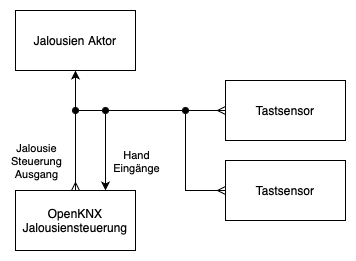
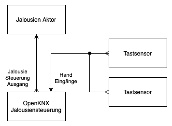

# Applikationsbeschreibung Jalousiensteuerung 

Die Jalousiensteuerung bietet unterschiedliche Betriebsarten.
Jede Betriebsart kann durch Ereignisse, Eingangs- oder Messwerte zulässig sein. 
Sind mehrere Betriebsarten zulässig, entscheidet die Priorität über die Auswahl.

## Inhaltsverzeichnis

- [Betriebsarten](#betriebsarten)
- [Diagnose](#diagnose)
- [Wichtige Informationen zur richtigen Konfiguration der Gruppenadressen](#wichtige-informationen-zur-richtigen-konfiguration-der-gruppenadressen)
- [Allgemein](#allgemein)
- [Kanalauswahl](#kanalauswahl)
- [Kanal 1-n](#kanal-1-n)
- [Handbetrieb](#handbetrieb)
- [Nachtmodus](#nachtmodus)
- [Szenen](#szenen)
- [Beschattungsmodus N](#beschattungsmodus-n)
- [Fenster Offen/Gekippt](#fenster-offengekippt)
- [Kommunikationsobjekte](#kommunikationsobjekte)

### ETS Konfiguration

Übersicht der Konfigurationsseiten der ETS-Applikation und Links zur jeweiligen Detailbeschreibung:

* [**Allgemein**](#allgemein)
  * [Globale Beschattungseinstellung](#globale-beschattungseinstellung) / [Verfügbare Messwerteingänge](#verfügbare-messwerteingänge) / [Messwertüberwachung](#messwertüberwachung) / [Messwerte](#messwerte)
* [**Kanalauswahl**](#kanalauswahl)
* [**Kanal 1-n**](#kanal-1-n)
  * [Modus Auswahl](#modus-auswahl) / [Beschattungseinstellungen](#beschattungseinstellungen) / [Raumbezogene Messwert Eingänge](#raumbezogene-messwert-eingänge)
  * [**Handbetrieb**](#handbetrieb) (Unterseite)
    * [Handbetriebseinstellung](#handbetriebseinstellung) / [Sonderfunktionen Tasterbedienung](#sonderfunktionen-tasterbedienung)
    * [Kurzer Druck 'Nach oben'](#kurzer-druck-nach-oben) / [Langer Druck 'Nach oben'](#langer-druck-nach-oben) / [Kurzer Druck 'Nach unten'](#kurzer-druck-nach-unten) / [Langer Druck 'Nach unten'](#langer-druck-nach-unten)
  * [**Nachtmodus**](#nachtmodus) (Unterseite)
    * [Nacht Beginn / Nacht Ende](#nacht-beginn--nacht-ende)
  * [**Szenen**](#szenen) (Unterseite)
  * [**Beschattungsmodus N**](#beschattungsmodus-n) (Unterseite, je nach Anzahl der konfigurierten Modi)
    * [Sonnenposition](#sonnenposition) / [Beschattungsunterbrechung](#beschattungsunterbrechung) / [Beschattungssteuerung](#beschattungssteuerung)
    * [Temperaturgrenzen](#temperaturgrenzen) / [Wetter](#wetter) / [Wohnraum](#wohnraum) / [Wartezeiten](#wartezeiten)
    * [Diagnoseobjekte für Beschattungsverhinderungsgrund](#diagnoseobjekte-für-beschattungsverhinderungsgrund) / ['Nicht erlaubt' Bits](#nicht-erlaubt-bits-nur-für-experten) / ['Nicht erlaubt' Grund](#nicht-erlaubt-grund)
  * [**Fenster Offen/Gekippt**](#fenster-offengekippt) (Unterseite)
    * [Gekippt wenn](#gekippt-wenn) / [Kontaktänderung auswerten nach](#kontaktänderung-auswerten-nach)
    * [Objekt 'Fenster gekippt/offen Kontakt'](#objekt-fenster-gekipptoffen-kontakt): [Position Anfahren](#position-anfahren) / [Lamelle öffnen](#lamelle-öffnen)
* [**Kommunikationsobjekte**](#kommunikationsobjekte)

## Betriebsarten

Folgende Betriebsarten - gereiht nach der Priorät - stehen zur Verfügung:

### Bereitschaft (Priorität 7 - niedrigste)

In dieser Betriebsart ist die Steuerung im Leerlauf und wartet auf Ereignisse die eine Wechsel der Betriebsart bewirken.

### Beschattung 1 (Priorität 6)

Dieser Modus steht nur zur Verfügung, wenn in der Kanaleinstellung unter "Modus Auswahl" **Beschattungsmodus Anzahl** mindestens 1 eingestellt wurde.

### Beschattung 2 (Priorität 5)

Dieser Modus steht nur zur Verfügung, wenn in der Kanaleinstellung unter "Modus Auswahl" **Beschattungsmodus Anzahl** 2 eingestellt wurde.

### Nachtmodus (Priorität 4)

Dieser Modus steht nur zur Verfügung, wenn in der Kanaleinstellung unter "Modus Auswahl" **Nachtmodus** aktiviert wurde.

Achtung: Wenn kein automatisches Ende konfiguriert ist, muss der Nachtmodus durch Handbetrieb oder durch AUS am Eingang `Nachtmodus Aus-/Einschalten` deaktiviert werden, damit eine Beschattung stattfindet kann.

### Handbetrieb (Priorität 3)

In diese Betriebsart wird gewechselt, sobald eine Handbedienung über einen der Eingänge erkannt wird:

- `Handbetrieb Auf/Ab`
- `Handbetrieb Stopp/Schritt`
- `Handbetrieb Prozent`
- `Handbetrieb Lamelle Prozent` 

zusätzlich kann der Handbetrieb über den Eingang 

`Handbetrieb Aus-/Einschalten` 

manuell aktiviert bzw. deaktiviert werden.

### Fenster gekippt (Priorität 2)

Dieser Modus ist nur verfügbar, wenn 2 Fensterkontakte zur Verfügung stehen.
Der Modus kann in den meisten Betriebsartenkonfiguriationen gesperrt werden.

### Fenster offen (Priorität 1 - Höchste)

Dieser Modus ist nur verfügbar, wenn mindestens ein Fensterkontakte zur Verfügung stehen.
Der Modus kann in den meisten Betriebsartenkonfiguriationen gesperrt werden.

## Diagnose

Die meisten Betriebsarten bieten einen Ausgang der über die aktuelle Aktivierung der Betriebsart informiert. 

Zusätzlich steht ein Ausgang zur Verfügung, der die Betriebsart als Szenennummer ausgibt:

`Aktiver Modus`

Verwendete Szenennummer:

1=Beschattung 1  
2=Beschattung 2  
3=Beschattung 3  
4=Beschattung 4  
10=Bereit  
11=Handbetrieb  
12=Nacht  
13=Fenster Kippstellung  
14=Fenster Geöffnet  
21-36=Szene (Szenenplatz 1-16), siehe Kapitel [Szenen](#szenen)  

Hinweis: Die Szenenummer wird auf dem KNX Bus beginnend mit 0 abgebildet. 
Szene 1 ist am Bus also 0. 
Bei machen Smart-Home Systemen (Z.B. OpenHAB) muss auf Bus-Wert abgefragt werden.

## Wichtige Informationen zur richtigen Konfiguration der Gruppenadressen

Die richtige Konfiguration ist abhängig von der Betriebart. Bitte daher die Hinweise im Kapitel [Handbetriebseinstellung](#handbetriebseinstellung) beachten.

# Applikationsprogramm

<!-- DOC -->
## Allgemein

(c) OpenKNX, Michael Geramb 2024

Die vollständige Anwendungsbeschreibung ist im Web unter https://github.com/OpenKNX/OFM-ShutterControllerModule/blob/v1/doc/Applikationsbeschreibung-ShutterController.md zu finden.

Insbesondere im Bereich Handbedienung sind wichtige Informationen zur richtigen Verbindung der Gruppenadresse im Kapitel "Handbetriebseinstellung" zu finden. 

### WARNUNG und Sicherheitshinweis:

Die Jalousiensteuerung darf aus Sicherheitsgründen nicht bei Beschattungseinrichtungen bei Notausgängen verwendet werden, da eine Automatik im Notfall das Öffnen verhindern könnte.

### Kanalauswahl

Auf dieser eigenen Seite werden alle Kanäle mit Geräteart und Beschreibung in einer Tabelle aufgelistet.
Ein Kanal wird über die Geräteart (Jalousie/Rollo) aktiviert; "Deaktiviert" schaltet ihn wieder aus.
Deaktivierte Kanäle werden nicht mehr im Kanalbaum angezeigt.

<!-- DOC -->
### Globale Beschattungseinstellung

<!-- DOC -->
#### Tägliche Aktivierung

Legt fest, ob eine deaktivierte Beschattungsautomatik am nächsten Tag wieder aktiviert werden soll.

- **AUS**  
  Es erfolgt keine automatische aktivierung der Beschattungsautomatik

- **EIN**  
  Es wird täglich um Mitternacht die Beschattungsautomatik eingeschalten

- **Über KO, Standard AUS**  
  Es wird nach dem Start die Beschattungsautomatik nicht täglich reaktivert.
  Die Funktion kann jedoch über ein Kommunikationsobjekt eing- bzw. ausgeschalten werden.

- **Über KO, Standard EIN**  
  Es wird nach dem Start die Beschattungsautomatik täglich reaktivert.
  Die Funktion kann jedoch über ein Kommunikationsobjekt ein- bzw. ausgeschalten werden.

- **Über KO, Standard AUS, initial vom Bus lesen**  
  Es wird nach dem Start die Beschattungsautomatik nicht täglich reaktivert.
  Die Funktion kann jedoch über ein Kommunikationsobjekt eing- bzw. ausgeschalten werden.
  Nach dem Gerätestart wird ein Lesetelegram für das Kommunikationsobjekt auf dem Bus gesendet.

- **Über KO, Standard EIN, initial vom Bus lesen**  
  Es wird nach dem Start die Beschattungsautomatik täglich reaktivert.
  Die Funktion kann jedoch über ein Kommunikationsobjekt ein- bzw. ausgeschalten werden.
  Nach dem Gerätestart wird ein Lesetelegram für das Kommunikationsobjekt auf dem Bus gesendet.

<!-- DOC -->
### Verfügbare Messwerteingänge
Verschiedene Messwerte können benutzt werden, um eine automatische Beschattung zu ermöglichen oder zu verhindern.
In diesem Abschnitt wird gewählt, welche Messwerte in der KNX-Anlage zur Verfügung stehen und zur Steuerung verwenden werden sollen.

<!-- DOC -->
### Messwertüberwachung
Die Messwertüberwachung wird verwendet um bei Ausfall eines Messwertes einen Notbetrieb zu Ermöglichen.

<!-- DOC -->
#### Ausfallsüberwachung
Die Ausfallüberwachung legt fest wie lange auf einem Messwert gewartet wird.
Empängt die Steuerung innerhalb der Zeitspannen keinen Wert, wird in den Notfallbetrieb gewechselt.

<!-- DOC -->
#### Verhalten bei Ausfall
Über diese Auswahl wird festgelegt, wie der Notfallbetrieb den fehlenden Messwert behandeln soll.
Wird innerhalb des Notbetriebes der fehlende Wert empfangen, wird der Notbetrieb automatisch beendet.

- **Wert ignorieren**  
Der Messwert wird bei der Bestimmung ob eine Beschattung zulässig ist nicht mehr berücksichtigt.

- **Leseanforderung schicken, dann ignorieren**  
Es wird einmalig ein Lesetelegram für den Messwert auf den Bus gesandt, erfolgt weiterhin keine Messwertübertragung wird der Wert bei der Bestimmung ob eine Beschattung zulässig ist nicht mehr berücksichtigt.

- **Fixen Wert vorgeben**  
Ein in der Konfiguration fest eingestellter Wert erstetzt den fehlenden Messwert.
Diese Einstellung wird empfohlen, wenn der Messwert entscheidend ist, welcher Beschattungsmodus aktiv werden soll. 
Über die geignet Wert-Vorgabe kann somit ein Modus bevorzugt werden.

- **Leseanforderung schicken, dann fixen Wert vorgeben**  
Diese Einstellung verhält sich gleich wie vorherige, jedoch wird zuerst einmal ein Lesetelegram für den Messwert auf den Bus gesandt. Erfolgt weiterhin keine Messwertübertragung wird der eingetragen Wert anstatt des Messwertes verwendet.

<!-- DOC -->
#### Wert

Der Wert der im Fehlerfall anstatt des Messwertes verwendet werden soll.
Zu beachten bei der Wahl des Wertes ist, dass dieser je nach Konfiguration entscheidend für die Auswahl des Beschattungsmodus sein kann.

<!-- DOC -->
### Messwerte

Es können verschiedene Messwerte für die automatische Beschattung verwendet werden.

<!-- DOC -->
#### Temperatur

Für den Temperatureingang sollte ein Außentemperatur-Fühler verwendet werden.

<!-- DOC -->
#### Temperatur Prognose

Dieser Eingang eignet sich für die prognostizierte Temperatur eines Wetterdienstes. 

<!-- DOC Skip="1" -->
Es kann hierfür z.B. die OpenKNX-Firmware [OAM-InternetServices](https://github.com/OpenKNX/OAM-InternetServices) mit dem [OFM-InternetWeatherModule](https://github.com/OpenKNX/OFM-InternetWeatherModule) verwendet werden.
<!-- DOCCONTENT
Es kann hierfür z.B. die OpenKNX-Firmware OAM-InternetServices mit dem OFM-InternetWeatherModule verwendet werden.
DOCCONTENT -->

<!-- DOC -->
#### Helligkeitssensoren

Legt fest, ob und wie viele Helligkeitssensoren verwendet werden:

- **Nein**: Kein Helligkeitssensor aktiv.
- **1 Sensor** bis **5 Sensoren**: Schaltet die entsprechende Anzahl Kommunikationsobjekte frei.

Bei Auswahl von 1 Sensor oder mehr erscheinen weitere Einstellungen fuer Aggregation, Ausrichtung und Watchdog.

<!-- DOC -->
##### Helligkeit Aggregation

Bestimmt, wie mehrere gueltige Helligkeitssensoren zusammengefasst werden, wenn keine Azimut-Auswertung verwendet wird.
"Mittelwert" mittelt alle gueltigen Sensoren, "Maximum" nimmt den hoechsten Wert.

<!-- DOC -->
##### Fenster-/Behangausrichtung und Azimut-Auswertung

Die Fenster-/Behangausrichtung im Kanal steuert, wie die Helligkeitssensoren ausgewertet werden:

- **Ost/Suedost/Sued/Suedwest/West**: Azimut-Auswertung ist aktiv. Es werden nur Sensoren mit Azimut-Zuordnung verwendet.
- **Dachflaeche**: Bevorzugt Sensoren ohne Azimut-Zuordnung (z.B. Dachsensor). Die eingestellte Aggregation wird ignoriert — es gilt immer der Maximalwert. Falls keine Sensoren ohne Azimut-Zuordnung vorhanden sind, greift ein automatischer Fallback: alle Sensoren werden mit Max-Aggregation ausgewertet.
- **Keine Himmelsrichtungsauswertung**: Azimut-basierte Sensorauswahl ist deaktiviert. Alle gueltigen Sensoren werden mit der eingestellten Aggregation (Mittelwert/Maximum) zusammengefasst.

Hinweis: Obwohl "Dachflaeche" und "Keine Himmelsrichtungsauswertung" beide die Azimut-Auswertung deaktivieren, unterscheiden sie sich in zwei Punkten. "Dachflaeche" bevorzugt gezielt Sensoren ohne Azimut-Zuordnung und erzwingt immer Max-Aggregation. "Keine Himmelsrichtungsauswertung" behandelt alle Sensoren gleichwertig und respektiert die konfigurierte Aggregation.

Beispiele (vereinfachte Sicht):

| Sensor-Setup | Fenster-/Behangausrichtung | Ergebnis fuer Helligkeit |
| --- | --- | --- |
| 3x Sensor mit Azimut (O/S/W) | Dachflaeche | Max(alle 3 Sensoren) — Fallback, da kein unzugeordneter Sensor |
| 4x Sensor mit Azimut + 1x Sensor ohne Azimut | Dachflaeche | Max(nur der Sensor ohne Azimut) |
| 4x Sensor mit Azimut + 1x Sensor ohne Azimut | Sued | Azimut-Interpolation nur mit den 4 Azimut-Sensoren |
| 2x Sensor ohne Azimut | Keine Himmelsrichtungsauswertung | Aggregation über alle Sensoren ohne Azimut |
| 1x Sensor mit Azimut | Keine Himmelsrichtungsauswertung | Aggregation über alle gueltigen Sensoren |

<!-- DOC HelpContext="Helligkeit-Sensor-1-5" -->
##### Ausrichtung Sensor 1..5

Azimut-Zuordnung fuer den jeweiligen Sensor in 5-Grad-Schritten.
"Keine Zuordnung" deaktiviert die Azimut-Auswertung fuer diesen Sensor.

<!-- DOC -->
#### UV-Index

Dieser Eingang eignet sich für den UV-Index eines Wetterdienstes.

<!-- DOC Skip="1" -->
Es kann hierfür z.B. die OpenKNX-Firmware [OAM-InternetServices](https://github.com/OpenKNX/OAM-InternetServices) mit dem [OFM-InternetWeatherModule](https://github.com/OpenKNX/OFM-InternetWeatherModule) verwendet werden.
<!-- DOCCONTENT
Es kann hierfür z.B. die OpenKNX-Firmware OAM-InternetServices mit dem OFM-InternetWeatherModule verwendet werden.
DOCCONTENT -->

<!-- DOC -->
#### Regen

Vorgesehen für den Regen-Indikator einer KNX-Wetterstation.

<!-- DOC -->
#### Wolkenbedeckung

Der Bedeckungsgrad durch Wolken in Prozent von einem Wetterdienst.

<!-- DOC Skip="1" -->
Es kann hierfür z.B. die OpenKNX-Firmware [OAM-InternetServices](https://github.com/OpenKNX/OAM-InternetServices) mit dem [OFM-InternetWeatherModule](https://github.com/OpenKNX/OFM-InternetWeatherModule) verwendet werden.
<!-- DOCCONTENT
Es kann hierfür z.B. die OpenKNX-Firmware OAM-InternetServices mit dem OFM-InternetWeatherModule verwendet werden.
DOCCONTENT -->

<!-- DOC -->
#### Dämmerung

Der Dämmerungswert in Lux, wie ihn viele KNX-Wetterstationen als eigenes Objekt bereitstellen.
Er kann im Nachtmodus der Kanäle als Helligkeit für die Schaltpunkte verwendet werden.

<!-- DOC HelpContext="Kanal" -->
## Kanal 1-n

Auf dieser Seite werden die verschiedenen Betriebsarten der Jalousiensteuerung festgelegt.
Der Kanal-Tab ist nur sichtbar, wenn der Kanal zuvor in der [Kanalauswahl](#kanalauswahl) aktiviert wurde.

#### Beschreibung

Die Beschreibung wird innerhalb der ETS verwenden um den Kanal und die Kanalobjekte zu benennen.
Es wird empfohlen, die Bezeichnung des Raumes oder der Jalousie zu verwenden.
Z.B. Küche, Wohnzimmer Süden, Wohnzimmer Terassentür, Schlafzimmer...

<!-- DOC -->
#### Geräteart

Die Art der Beschattungseinrichtung. Aktiviert wird ein Kanal in der [Kanalauswahl](#kanalauswahl); auf dem Kanal-Tab kann die Geräteart nachträglich gewechselt werden, ohne den Kanal dabei zu deaktivieren.

- **Jalousie**  
Erlaubt eine Positionsvorgabe und Lamellensteuerung.

- **Rollo**  
Erlaubt eine Positionsvorgabe.
Es steht keine Lamellensteuerung zur Verfügung.

#### Suspendiert

Mit dieser Einstellung kann ein Kanal vorübergehend deaktiviert werden, ohne das die Konfigurationswerte und Gruppenadressen an den Kommunikationsobjekten verloren gehen.
Ein suspendierter Kanal sendet keine Telegramme auf dem KNX-Bus und wird im Kanalbaum mit ⛔ gekennzeichnet.

<!-- DOC -->
### Modus Auswahl

<!-- DOC -->
#### Nachtmodus

Über den Nachtmodus kann die Jalousie oder der Rolladen am Abend automatisch geschlossen und in der Früh geöffnet werden.

<!-- DOC -->
#### Fenster offen

Fenster können einen oder zwei Kontakte zur Verfügung stellen. 
Bei zwei Kontakten kann zwischen Kippstellung und vollständiger Fensteröffnung unterschieden werden und die Steuerung der Jalousie unterschiedlich erfolgen. 
Z.B. kann bei der Kippstellung einer Terrassentüre die Lamelle in die Waagrechte Position gebracht werden um einen optimales Luftzug zu ermöglichen während bei der vollständigen Öffnung die Jalousie hochgefahren werden um den Durchgang zu ermöglichen.

<!-- DOC -->
#### Beschattungsmodus Anzahl

Die Steuerung ermöglicht unterschiedliche Beschattungen abhängig von Messwerten.
Beispielsweise könnnen bei Hitzetagen die Jalousienlamellen geschlossen werden um die Hitze bestmöglich abzuschirmen während bei mäßig warmen Tagen die Lamellen an den Sonnenstand angepasst werden um das Tageslicht in den Raum zu lassen.

<!-- DOC -->
### Beschattungseinstellungen

<!-- DOC -->
#### Beschattung nach Handbetrieb unterbrechen

Mit dieser Einstellung wird festgelegt, wie lange die Beschattung nach dem Handbetrieb unterbrochen wird. 
Bei einer Unterbrechung wird das Kommunikationsobjekt "Beschattung Eingeschaltet" auf AUS gesetzt. Mit einem EIN Befehl auf das Kommunikationsobjekt "Beschattung Einschalten" kann die Beschattung jederzeit wieder manuell aktiviert werden.

Für die automatische reaktiverung stehen folgende Einstellungen bereit:

- für diese Periode deaktivieren  
  Bei dieser Einstellung wird für die Beschattungsperiode die sich aus den konfigurierten Sonnenstandsgrenzen ergibt, deaktivert.

- Zeiten von 1 Minute bis zu 12h  
  Achtung, wird diese Zeit sehr kurz gewählt, wird die Jalousie nach einer manuellen Öffnung sehr schnell wieder in die Beschattungsposition gefahren. Es wird daher emfohlen eine Zeit von mindenstens 30 Minuten zu verwenden. 

<!-- DOC -->
#### Nach Beschattung

Diese Einstellung legt fest, was am Ende der Beschattung passieren soll.

- Keine Änderung  
  Die Jalousie bleibt in der letzten Beschattungseinstellung

- Position vor Beschattungsstart
  Die Position und bei Jalousien auch die Lamellenstellung die zuletzt vor der Beschattung verwendet wurde, wird wieder hergestellt.
  Damit die Jalousiensteuerung die Jalousienposition vor der Beschattung richtig bestimmen kann, ist wichtig, dass alle Handeingänge mit den richtigen Gruppeneingängen verbunden werden. 
  Achtung: Bei Jalousienbedienung über Szenen des Aktors kann die Jalousiensteuerung die richtige Position nicht zuverlässig erkennen. 
  In diesem Fall wird dieser Modus nicht empfohlen.

- Fährt Auf
  Die Jalousie wird vollständig geöffnet.

- Lamelle Waagrecht (Einstellung nur bei Geräteart 'Jalousie' vorhanden)  
  Die Jalousie bleibt in der Position der Beschattung, jedoch wird die Lamelle waagrecht (50%) gestellt.

- Benutzerdefinierte Position
  Fährt die benutzerdefinierten Werte an 

<!-- DOC -->
#### Position anfahren

Fährt die Position an. 

<!-- DOC -->
#### Lamellenstellung anfahren

Fährt die Lamellenstellung an. 

<!-- DOC -->
### Raumbezogene Messwert Eingänge

Auch Messwerte des Raums der Beschattet wird, können für die Entscheidung ob Beschattet werden soll oder nicht heranzgeogen werden.

<!-- DOC -->
#### Heizung

In dieser Einstellung kann festgelegt werden ob die Heizung als Messgröße verwendet wird.
Diese Einstellung ist Sinnvoll um eine Beschattung während der Heizperiode zu unterbinden.
Dabei kann der festgelegt werden, ob am KNX-Bus lediglich die Heizanforderung als Gruppenadresse zur Verfügung steht oder die aktuelle Stellgröße des Heizungsaktors.

<!-- DOC -->
#### Raumtemperatur

Die Raumtemperatur kann verwendet werden um bei zu niedriger Raumtemperatur die Beschattung zu sperren damit die Sonneneinstrahlung als natürliche Wärmequelle benutzen wird.

<!-- DOC -->
## Handbetrieb

In diesem Abschnitt wird die Konfiguration für die manuelle Steuerung der Jalousie bzw. des Rolladen vorgenommen.

Achtung: die manuelle Steuerung kann je nach Einstellung von 'Handbetriebseinstellung' im Nacht-, Fenster Offen-, Beschattungsmodus deaktivert werden.

<!-- DOC -->
### Handbetriebseinstellung

In diesem Abschnitt werden Optionen festgelegt, wie die Steuerung sich im Fall einer Handbedienung verhalten soll.

#### Anschluss der Gruppenadressen

Abhängig davon, ob die Handbedienung über den Aktor oder über die OpenKNX Jalousiensteuerung erfolgen soll, müssen die Gruppenadressen unterschiedlich verbunden werden.
**Wichtig** Unabhängig vom Modus müssen alle Gruppenadressen die für die Handsteuerung verwendet werden an die entsprechenden Handbedienungseingänge der OpenKNX Jalousiensteuerung verbunden werden.

#### Manuelle Bedienung über den Aktor

<!-- DOC Skip="1" -->
  
In dieser Einstellung erfolgt die Bedienung im Handbetrieb weiterhin direkt über den Aktor.
Diese Einstellung bietet eine erhöhte Betriebssicherheit, da bei einem Ausfall der Steuerung die Bedienung weiterhin gewährleistet ist.
Jedoch steht die Möglichkeit der Sperre der Handbedienung in diesem Modus nicht zur Verfügung.

#### Manuelle Bedienung über die OpenKNX Jalousiensteuerung ("Modul sendet AUF/AB zum Aktor" und "Modul sendet 0/100% zum Aktor")

<!-- DOC Skip="1" -->
  
In dieser Einstellung werden getrennte Gruppenadressen für die Verbindung zwischen Steuerung und Aktor benötigt. Die Jalousienaktor Ansteuerung erfolgt ausschließlich über die Steuerung, die bei Bedarf Befehle von den Tastsensoren weiterleitet.
Der Vorteil dieser Einstellung ist, das die Bedienung über die Tasten durch die Steuerung unterbunden werden kann.

Für die Ansteuerung des Aktors stehen die beiden Einstellung "Modul sendet AUF/AB zum Aktor" und "Modul sendet 0/100% zum Aktor" zur Verfügung. 
Welche der beiden Einstellungen verwendet werden soll, hängt dabei vom jeweiligen Jalousienaktor ab und es muss getestet werden, welche das bessere Ergebniss liefert. 
Empfohlen wird mit der Einstellung "Modul sendet 0/100% zum Aktor" zu beginnen, da diese Einstellung der OpenKNX Jalousien Steuerung mehr Kontrolle über den Aktor bietet.

##### Modul sendet AUF/AB zum Aktor

In dieser Konfiguration muss eine eigene Gruppenadresse zur Verbindung der Jalousiensteuerung mit dem Aktor für das AUF/AB Telegram das am Kommunikationsobjekt "Auf/Ab Ausgang" gesendet wird, konfiguriert werden. 
Jeder manuelle Bedienung über das Kommunikationsobjekt "Handbetrieb Auf/Ab" wird and den Ausgang weitergeleitet, so eine Bedienung über Hand aktuell zulässig ist.

##### Modul sendet 0/100% zum Aktor

In dieser Konfiguration werden Eingangs-Telegramme an den Kommunikationsobjekten "Handbetrieb Auf/Ab" auf Ausgangstelegramme an den Kommunikationsobjekten "Jalousie Prozent Ausgang" umgesetzt.

<!-- DOC -->
#### Erstes manuelles AUF ignorieren, wenn bei Beschattungstart geschlossen

Dieser Einstellung soll verwendet werden ein Taster zum gleichzeitig Öffnen von mehrere Jalousien verwendet wird, diese aber nicht alle die Beschattung benutzen.
In diesem Fall verhindert die Einstellung, dass bei aktiver Beschattung die Jalousie sich mit öffnet.
Jalousien ohne aktiver Beschattung werden aber weiterhin normal geöffnet.

Bei Handbedienungseinstellung "Manuelle Bedienung über Aktor" wird zum ignorieren des manuellen Befehls über das Kommunikationsobjekt "Stopp/Schritt Ausgang" ein Stopp gesendet. Es kann dabei trotzdem zu einer minimalen Bewegung oder einem Geräusch der Jalousie kommen. In den beiden anderen Handbedienungseinstellung "Modul sendet AUF/AB zum Aktor" und "Modul sendet 0/100% zum Aktor" tritt dieser Effekt nicht auf, da in diesem Fall der Aktor keinen Fahrbefehl erhält.

<!-- DOC -->
#### Handbedienung bei globaler Kanal-Sperre erlauben 
Diese Option ist nicht verfügbar wenn "Manuelle Bedienung über den Aktor" unter "Handbetriebseinstellung" gewählt wurde.

Mit diese Einstellung wird festgelegt, ob eine Handsteuerung bei aktiver Sperre am Kommunikationsobjekt "Sperre" des Kanals zugelassen ist.

<!-- DOC -->
#### Sperrzeit für Automatiken nach Handbedienung

Innerhalb der eingestellten Zeit wird ein Beschattungsstart oder der Nachtmodus verhindert.

<!-- DOC -->
### Sonderfunktionen Tasterbedienung

Die OpenKNX Jalousiensteuerung kann Fahrbefehle die normalerweise keine Auswirkung auf die Jalousie haben für Steuerbefehle benutzen.

<!-- DOC -->
### Zusätzliches Kommunikationsobjekt-ohne-Sonderfunktion-Auswertung

Über diese Option kann ein weiteres Kommunikationsobjekt für 'Handbetrieb Steuerung Auf/Ab (ohne Sonderfunktion)' eingeblendet werden, an dem keine Auswertung der Sonderfunktionen erfolgt. 

Beispiel Anwendung:
Es gibt einen Taster der nur die betreffende Jalousie steuert und einen anderen Taster der mehrere Jalousien gleichzeitig bedient. Wenn nun die Sonderfunktion nur am ersten Taster der nur die betreffende Jalousie steuern soll verfügbar sein soll, muss für den zweiten Taster mit der Gruppensteuerung eine eigene Gruppenadresse angelegt werden und mit dem Kommunkiationsobject 'Handbetrieb Steuerung Auf/Ab (ohne Sonderfunktion)' verbunden werden.

<!-- DOC -->
### Kurzer Druck 'Nach oben'

Ist die Jalousie in der vollständig geöffneten Stellung (0%) und wird ein Eingangstelegram am Kommunikationsobjekt "Handbetrieb Stopp/Schritt" für AUF empfangen, kann dieses für folgende Funktionen benutzt werden:

- Beschattungsautomatik EIN/AUS

Die Beschattungsautomatik wird je nach vorherigem Zustand Aus, bzw. Eingeschalten. 
Damit kann mit den normalen Jalousientaster die Beschattungsautomatik mit einem kurzen Druck gesteuert werden. 
Die Einstellung ist nur sinnvoll Nutzbar wenn die Jalousiensteuerung über 2 Tasten erfolgt.

- Beschattungsautomatik EIN

Die Beschattungsautomatik wird eingeschalten. 
Damit kann mit den normalen Jalousientaster die Beschattungsautomatik mit einem kurzen Druck eingeschalten werden. 
Die Einstellung ist nur sinnvoll Nutzbar wenn die Jalousiensteuerung über 2 Tasten erfolgt.

- Beschattungsautomatik AUS

Die Beschattungsautomatik wird ausgeschalten. 
Damit kann mit den normalen Jalousientaster die Beschattungsautomatik mit einem kurzen Druck ausgeschalten werden. 
Die Einstellung ist nur sinnvoll Nutzbar wenn die Jalousiensteuerung über 2 Tasten erfolgt.

- Jalousien schließen

Ist diese Einstellung aktiv, kann bei einer 2 Tastenbedienung auch mit einem kurzen Tastendruck die Jalousie geschlossen werden. Dazu muss lediglich der "Auf" Knopf bei vollständig geöffneter Jalousie kurz betätigt werden.

<!-- DOC -->
### Langer Druck 'Nach oben'

Ist die Jalousie in der vollständig geöffneten Stellung (0%) und wird ein Eingangstelegram am Kommunikationsobjekt "Handbetrieb Auf/Ab" für AUF empfangen, kann dieses für folgende Funktionen benutzt werden:

- Beschattungsautomatik EIN/AUS

Die Beschattungsautomatik wird je nach vorherigem Zustand Aus, bzw. Eingeschalten. 
Damit kann mit den normalen Jalousientaster die Beschattungsautomatik mit einem langen Druck gesteuert werden. 
Die Einstellung ist nur sinnvoll Nutzbar wenn die Jalousiensteuerung über 2 Tasten erfolgt.

- Beschattungsautomatik EIN

Die Beschattungsautomatik wird eingeschalten. 
Damit kann mit den normalen Jalousientaster die Beschattungsautomatik mit einem langen Druck eingeschalten werden. 
Die Einstellung ist nur sinnvoll Nutzbar wenn die Jalousiensteuerung über 2 Tasten erfolgt.

- Beschattungsautomatik AUS

Die Beschattungsautomatik wird ausgeschalten. 
Damit kann mit den normalen Jalousientaster die Beschattungsautomatik mit einem langen Druck ausgeschalten werden. 
Die Einstellung ist nur sinnvoll Nutzbar wenn die Jalousiensteuerung über 2 Tasten erfolgt.

- Jalousien schließen

Ist diese Einstellung aktiv, kann bei einer 2 Tastenbedienung auch mit einem langen Tastendruck nach oben die Jalousie geschlossen werden. Somit ist egal, ob der AUF oder AB Knopf lange betätigt wird, die Jalousie schließt sich in beiden Fällen.

<!-- DOC -->
### Kurzer Druck 'Nach unten'

Ist die Jalousie in der vollständig geschlossener Stellung (100%) und wird ein Eingangstelegram am Kommunikationsobjekt "Handbetrieb Stopp/Schritt" für AB empfangen, kann dieses für folgende Funktionen benutzt werden:

- Beschattungsautomatik EIN/AUS

Die Beschattungsautomatik wird je nach vorherigem Zustand Aus, bzw. Eingeschalten. 
Damit kann mit den normalen Jalousientaster die Beschattungsautomatik mit einem kurzen Druck gesteuert werden. 
Die Einstellung ist nur sinnvoll Nutzbar wenn die Jalousiensteuerung über 2 Tasten erfolgt.

- Beschattungsautomatik EIN

Die Beschattungsautomatik wird eingeschalten. 
Damit kann mit den normalen Jalousientaster die Beschattungsautomatik mit einem kurzen Druck eingeschalten werden. 
Die Einstellung ist nur sinnvoll Nutzbar wenn die Jalousiensteuerung über 2 Tasten erfolgt.

- Beschattungsautomatik AUS

Die Beschattungsautomatik wird ausgeschalten. 
Damit kann mit den normalen Jalousientaster die Beschattungsautomatik mit einem kurzen Druck ausgeschalten werden. 
Die Einstellung ist nur sinnvoll Nutzbar wenn die Jalousiensteuerung über 2 Tasten erfolgt.

- Jalousien öffnen

Ist diese Einstellung aktiv, kann bei einer 2 Tastenbedienung auch mit einem kurzen Tastendruck die Jalousie geöffnet werden. Dazu muss lediglich der "Auf" Knopf bei vollständig geöffneter Jalousie kurz betätigt werden.

<!-- DOC -->
### Langer Druck 'Nach unten'

Ist die Jalousie in der vollständig geschlossener Stellung (100%) und wird ein Eingangstelegram am Kommunikationsobjekt "Handbetrieb Auf/Ab" für AB empfangen, kann dieses für folgende Funktionen benutzt werden:

- Beschattungsautomatik EIN/AUS

Die Beschattungsautomatik wird je nach vorherigem Zustand Aus, bzw. Eingeschalten. 
Damit kann mit den normalen Jalousientaster die Beschattungsautomatik mit einem langen Druck gesteuert werden. 
Die Einstellung ist nur sinnvoll Nutzbar wenn die Jalousiensteuerung über 2 Tasten erfolgt.

- Beschattungsautomatik EIN

Die Beschattungsautomatik wird eingeschalten. 
Damit kann mit den normalen Jalousientaster die Beschattungsautomatik mit einem langen Druck eingeschalten werden. 
Die Einstellung ist nur sinnvoll Nutzbar wenn die Jalousiensteuerung über 2 Tasten erfolgt.

- Beschattungsautomatik AUS

Die Beschattungsautomatik wird ausgeschalten. 
Damit kann mit den normalen Jalousientaster die Beschattungsautomatik mit einem langen Druck ausgeschalten werden. 
Die Einstellung ist nur sinnvoll Nutzbar wenn die Jalousiensteuerung über 2 Tasten erfolgt.

- Jalousien öffnen

Ist diese Einstellung aktiv, kann bei einer 2 Tastenbedienung auch mit einem langen Tastendruck nach oben die Jalousie geöffnet werden. Somit ist egal, ob der AUF oder AB Knopf lange betätigt wird, die Jalousie öffnet sich in beiden Fällen.

<!-- DOC -->
## Nachtmodus

Über diesen Modus kann die Jalousie oder der Rollladen abends und morgens automatisch geschlossen bzw. geöffnet werden, auf Wunsch in zwei Stufen. Auslöser sind Uhrzeit, Sonnenstand und Helligkeit, getrennt nach Wochentagen.

<!-- DOC -->
#### Fenster offen Modus erlaubt

Nur verfügbar wenn mindestens ein Fensterkontake konfiguriert wurde.
Über diese Einstellung wird konfiguriert ob während des aktiven Nachtmodus die Fenster offen Stellung verwendet wird.

<!-- DOC -->
#### Fenster gekippt Modus erlaubt

Nur verfügbar wenn 2 Fensterkontake konfiguriert wurden.
Über diese Einstellung wird konfiguriert ob während des aktiven Nachtmodus die Fenster gekippt Stellung verwendet wird.

<!-- DOC -->
### Nachtstufen

Der Nachtmodus kennt vier Stufen:

| Stufe | Bedeutung | Fahrrichtung |
|---|---|---|
| Vorstufe Abend | optionale Zwischenstellung am Abend, z. B. 70 % / Lamelle 50 %, damit noch Restlicht hereinkommt | schließen |
| Nacht | Nachtstellung, z. B. ganz geschlossen | schließen |
| Vorstufe Morgen | optionale Zwischenstellung am Morgen | öffnen |
| Tag | Ende der Nacht, z. B. ganz geöffnet | öffnen |

Eine Stufe löst aus, sobald einer ihrer [Schaltpunkte](#schaltpunkte) erfüllt ist. Was dabei angefahren wird, legt die Tabelle [Stufen](#stufen) fest. Die Vorstufen sind nur aktiv, wenn ein Schaltpunkt sie verwendet; ohne solche Schaltpunkte arbeitet der Nachtmodus einstufig wie bisher.

Ablauf:

- Der Nachtmodus ist von der ersten Abendstufe bis zur Stufe "Tag" aktiv. Das Kommunikationsobjekt "Nachtmodus Aktiv" und die Einstellung ["In der Nacht anders"](#in-der-nacht-anders) der Fensterkontakte gelten daher schon ab der Vorstufe Abend. Die aktuelle Stufe meldet das Kommunikationsobjekt "Nachtstufe".
- Ein Nachtzyklus läuft von 12:00 bis 11:59 des Folgetags. Jede Stufe löst darin höchstens einmal aus. Abendstufen werten ab 12:00 aus (auch nach Mitternacht), Morgenstufen von 00:00 bis 11:59.
- Hat die Stufe "Nacht" bereits ausgelöst, entfällt die Vorstufe Abend in diesem Zyklus; ebenso entfällt die Vorstufe Morgen, wenn "Tag" schon ausgelöst hat.
- Das Kommunikationsobjekt "Nachtmodus Aus-/Einschalten" startet mit 1 die Stufe "Nacht" und beendet mit 0 den Nachtmodus mit der Stufe "Tag".
- Wird der Nachtmodus durch Handbetrieb oder Sperre unterbrochen, fährt er bei der Rückkehr nicht erneut. Hat in der Zwischenzeit eine neue Stufe ausgelöst, wird diese bei der Rückkehr angefahren.
- Nach einem Neustart wird die aktuelle Stufe aus den Schaltpunkten wiederhergestellt. Zwischen 12:00 und 23:59 wird sie angefahren, zwischen 00:00 und 11:59 nur übernommen, ohne zu fahren. Ein vorher über das Kommunikationsobjekt "Nachtmodus Aus-/Einschalten" geändertes Verhalten geht dabei verloren.
- Ist bei einem Fenster "'Fenster offen' Modus erlaubt" aktiv, begrenzt ein geöffnetes Fenster wie bisher die Position. Die Position der Stufe wird gemerkt und nach dem Schließen des Fensters angefahren. Ist die Einstellung deaktiviert, greift im Nachtmodus keine Aussperrverhinderung.

<!-- DOC -->
#### Verhalten bei Sperre

Legt fest, was passiert, wenn das Kommunikationsobjekt "Nachtmodus Sperre" während der Nacht gesetzt wird:

- Tag-Position anfahren: Der Nachtmodus endet und die Position der Stufe "Tag" wird angefahren (bisheriges Verhalten).
- keine Aktion: Der Behang bleibt stehen. Die Position der Stufe "Tag" wird erst angefahren, wenn die Nacht wirklich endet.

<!-- DOC -->
#### Beschattung hat in den Vorstufen Vorrang

Bei "Ja" überlässt der Nachtmodus während der Vorstufe Abend und der Vorstufe Morgen einer erlaubten Beschattung den Vorrang, z. B. wenn morgens die Sonne schon auf ein Ostfenster scheint. Endet die Beschattung vor der nächsten Stufe, übernimmt der Nachtmodus wieder, ohne zu fahren. Die Stufen "Nacht" und "Tag" haben immer Vorrang vor der Beschattung.

<!-- DOC -->
#### Fahrverzögerung

Verzögert jede Stufe dieses Kanals um die angegebene Zeit in Sekunden, unabhängig vom Auslöser, auch beim Kommunikationsobjekt "Nachtmodus Aus-/Einschalten". Damit lassen sich mehrere Rollläden, die zur gleichen Zeit auslösen, um einige Sekunden versetzt fahren, z. B. um Stromspitzen im Jalousieaktor zu vermeiden. 0 = sofort.

<!-- DOC -->
#### Feiertage

Legt fest, wie die Schaltpunkte an Feiertagen ausgewertet werden:

- nicht beachten: Es gelten die Einstellungen des jeweiligen Wochentags.
- wie Sonntage behandeln: Es gelten die Einstellungen für Sonntag.

Welche Tage Feiertage sind, wird in der Logik unter "Feiertage" festgelegt. Für Abendstufen nach Mitternacht zählt weiterhin der Tag, an dem der Nachtzyklus begonnen hat.

<!-- DOC -->
#### Helligkeit im Nachtmodus

Legt fest, welcher Helligkeitswert für die Schaltpunkte verwendet wird. Angeboten wird nur, was in den allgemeinen Einstellungen freigegeben ist:

- Nein: Die Schaltpunkte werten keine Helligkeit aus.
- Dämmerungssensor: Wert des Eingangs ["Dämmerung"](#dämmerung).
- Helligkeitssensoren: Mittelwert / Maximum: Mittelwert bzw. größter Wert aller Helligkeitssensoren der Beschattung.
- Helligkeitssensor in Fensterrichtung: Der Sensor bzw. die Sensoren, die zur eingestellten Fenster-/Behangausrichtung passen.

Fehlt der Helligkeitswert oder liefert ein Sensor nur einen Ersatzwert, wird die Helligkeit nicht verwendet: Bei "oder" zählt sie nicht, bei "und" blockiert sie den Schaltpunkt nicht.

<!-- DOC -->
#### Mindestdauer Helligkeit

So lange muss die Helligkeitsschwelle ununterbrochen unter- bzw. überschritten sein, bevor sie als erfüllt gilt. Damit lösen kurze Helligkeitseinbrüche, z. B. durch Wolken, keine Stufe aus. 0 = sofort.

<!-- DOC HelpContext="Schaltpunkte" -->
### Schaltpunkte

Jeder Kanal hat 8 Schaltpunkte. Ein Schaltpunkt legt fest, an welchen Wochentagen und unter welcher Bedingung eine Stufe auslöst. Mehrere Schaltpunkte derselben Stufe sind ODER-verknüpft: Der erste erfüllte Schaltpunkt löst die Stufe aus.

- **Stufe**: Die Stufe, die der Schaltpunkt auslöst, oder "nicht aktiv".
- **Mo-So**: Die Wochentage, an denen der Schaltpunkt gilt. Für Abendstufen zählt der Tag, an dem der Nachtzyklus begonnen hat (eine Zeit nach Mitternacht am Freitag gehört noch zum Freitag). An Feiertagen gelten je nach Einstellung ["Feiertage"](#feiertage) die Einstellungen für Sonntag.
- **Auslöser**:
  - Uhrzeit
  - bei Sonnenuntergang / Sonnenaufgang
  - Sonnenuntergang / Sonnenaufgang minus bzw. plus Zeitversatz (hh:mm)
  - Ende bzw. Beginn der bürgerlichen Dämmerung (Sonne 6° unter dem Horizont)
  - Ende bzw. Beginn der nautischen Dämmerung (Sonne 12° unter dem Horizont)
  - Sonnenuntergang / Sonnenaufgang über bzw. unter Horizont (Höhenwinkel in Grad)
  - dunkler als / heller als (Lux), nur wenn "Helligkeit im Nachtmodus" verwendet wird
- **Wert**: Uhrzeit, Zeitversatz, Höhenwinkel oder Lux, je nach Auslöser.
- **Helligkeit / Lux**: Verknüpft den Auslöser innerhalb des Schaltpunkts mit der Helligkeit: "und dunkler als" (beides muss erfüllt sein) oder "oder dunkler als" (eines genügt). Morgens entsprechend "heller als".
- **Bedingung / Zeit**: "frühestens um" verhindert ein Auslösen vor dieser Zeit. "spätestens um" löst zu dieser Zeit auch dann aus, wenn Auslöser und Helligkeit noch nicht erfüllt sind.

Ausgewertet wird in dieser Reihenfolge: (Auslöser und/oder Helligkeit), danach die Bedingung.

Beispiele:

| Stufe | Tage | Auslöser | Helligkeit | Bedingung | Ergebnis |
|---|---|---|---|---|---|
| Nacht | Mo-So | bei Sonnenuntergang | oder dunkler als 20 Lux | spätestens um 22:00 | schließt bei Sonnenuntergang oder Dunkelheit, spätestens um 22:00 |
| Nacht | Mo-So | dunkler als 20 Lux | | frühestens um 17:00 | kein Schließen bei einem Gewitter am Nachmittag |
| Tag | Mo-Fr | bei Sonnenaufgang | | frühestens um 06:00 | Wochentags nicht vor 06:00 |
| Tag | Sa, So | Uhrzeit 08:30 | | | am Wochenende um 08:30 |
| Vorstufe Abend | Mo-So | Sonnenuntergang minus Zeitversatz 00:30 | | | 30 Minuten vor Sonnenuntergang |

Uhrzeiten von Abendstufen vor 12:00 gelten als "nach Mitternacht". Uhrzeiten von Morgenstufen ab 12:00 werden wie 11:59 behandelt.

<!-- DOC HelpContext="Stufen" -->
### Stufen

Legt je Stufe fest, ob und wohin der Behang fährt.

- **Aktion**:
  - Nein: Die Stufe fährt nicht.
  - Nur schließen (Abendstufen) / Nur öffnen (Morgenstufen): Die Stufe fährt nur, wenn der Behang dadurch weiter geschlossen bzw. weiter geöffnet wird. Ein von Hand geschlossener Rollladen wird abends also nicht wieder geöffnet, ein von Hand geöffneter morgens nicht wieder geschlossen.
  - Öffnen und Schließen: Die Stufe fährt immer ihre Position an, z. B. für eine Lüftungsstellung in der Nacht oder eine Sichtschutzstellung am Tag.
- **Höhe / Lamelle**: Die Position der Stufe. Die Lamelle ist nur bei Jalousien verfügbar.

"Nur schließen" und "Nur öffnen" benötigen die Aktorrückmeldung der Position. Ohne Rückmeldung fährt die Stufe immer.

Bei der Übernahme einer Konfiguration einer früheren Version wird "Nacht Beginn" zu Schaltpunkt 1 (Stufe "Nacht"), "Nacht Ende" zu Schaltpunkt 2 (Stufe "Tag"), jeweils für Mo-So, und die Aktion "Position anfahren" zu "Nur schließen" bzw. "Nur öffnen".

<!-- DOC HelpContext="Szenen" -->
## Szenen

Jedem Kanal können bis zu 16 KNX-Szenen zugeordnet werden. Eine Szene fährt die Höhe an (bei Jalousie zusätzlich die Lamelle) und kann die Sperren für Beschattungssteuerung, Nachtmodus und Handbetrieb setzen.

Aktiviert wird die Funktion mit dem Parameter "Szenen" auf der Kanalseite. Danach erscheint die Unterseite "Szenen" mit dem Kommunikationsobjekt "Szene" (DPT 17.001/18.001) und der Szenentabelle.

**Abruf und Lernen**

Über das Objekt "Szene" wird eine Szene abgerufen (DPT 17.001) oder gelernt (DPT 18.001, Bit 7 gesetzt). Beim Lernen wird die aktuelle Höhe (und Lamelle) einer als "speicherbar" markierten Szene im Gerät gespeichert und bei künftigen Abrufen anstelle der ETS-Werte angefahren. Gelernte Werte bleiben nach einem Neustart und einem erneuten ETS-Download erhalten, bis die Szene neu gelernt wird.

**Tabellenspalten**

- **freigeben**: Schaltet die Szenenzeile frei. Nur freigegebene Zeilen reagieren auf das Kommunikationsobjekt "Szene".
- **KNX-Szene**: Die KNX-Szenennummer (1–64), auf die diese Zeile reagiert.
- **speicherbar**: Legt fest, ob die Szene durch Lernen (DPT 18, Bit 7) überschrieben werden kann.
- **Höhe anfahren / Höhe**: Ist "Höhe anfahren" gesetzt, wird die danebenstehende Höhe in % angefahren. Ist es nicht gesetzt, bleibt die aktuelle Höhe unverändert.
- **Lamelle anfahren / Lamelle** (nur Jalousie): wie "Höhe anfahren/Höhe", für die Lamellenstellung.
- **Sperre/Freigabe**: Setzt beim Abruf die Sperren für Beschattungssteuerung, Nachtmodus und – sofern "Handbetriebseinstellung" auf eine Steuerung über den Controller eingestellt ist – zusätzlich für den Handbetrieb. Jede der drei Funktionen kann unabhängig auf "unverändert", "sperren" oder "freigeben" gesetzt werden.
- **Nach Abruf**: Legt fest, was nach dem Szenenabruf gilt.
  - *Automatikmodus aktiv* (Standard): Die Szene fährt die Position an; sobald ihre Fahrbefehle gesendet sind, ist wieder die Automatik zuständig – klassisches KNX-Szenenverhalten. Sperren, die diese Szene setzt, bleiben bestehen (sie wirken wie ein Sperr-Telegramm).
  - *Szenenmodus bleibt aktiv*: Die Szene bleibt aktiv und hält die Beschattung zurück, bis eine Handbedienung, der Nachtmodus, die Kanalsperre oder eine andere Szene sie ablöst. Sperren, die diese Szene gesetzt hat, werden beim Verlassen wieder zurückgenommen.
- **Verzögerung**: Zeit (hh:mm:ss, max. 12:00:00) zwischen Szenenabruf und Ausführung. Ein weiterer Abruf während der Verzögerung ersetzt die wartende Szene, eine Handbedienung verwirft sie.
- **Beschreibung**: Freitext nur für die ETS, ohne Speicherung im Gerät.

**Priorität und Verlassen**

Der Szenen-Modus reiht sich in die Betriebsarten wie folgt ein: Handbetrieb > Nachtmodus > **Szene** > Beschattung 2 > Beschattung 1 > Bereitschaft. Ist die Kanalsperre aktiv, wird ein Szenenabruf ignoriert.

Wie lange der Szenen-Modus aktiv bleibt, steuert die Spalte **Nach Abruf**:

- Bei *Automatikmodus aktiv* bleibt der Szenen-Modus nur so lange aktiv, bis die Fahrbefehle der Szene tatsächlich gesendet wurden. Höhe und Lamelle werden bewusst um etwa eine Sekunde versetzt gesendet, bei Jalousien dauert die Übergabe deshalb rund eine Sekunde, bei Rollläden nur einen Zyklus. Die angefahrene Position bleibt anschließend so lange stehen, bis die Automatik selbst einen Grund hat zu fahren – die Beschattung übernimmt also, sobald ihre Bedingungen erfüllt sind.
- Bei *Szenenmodus bleibt aktiv* bleibt der Szenen-Modus aktiv und verhindert damit, dass die Beschattung fährt. Er endet erst durch eine Handbedienung, den Start des Nachtmodus, die Kanalsperre oder den Abruf einer anderen Szene; eine dadurch unterbrochene Szene wird danach nicht fortgesetzt. Beim Verlassen wird der Zustand der von der Szene gesetzten Sperren wiederhergestellt, sofern er seit dem Szenenstart nicht durch ein Kommunikationsobjekt verändert wurde.

Nach jedem Szenenabruf bewertet die Beschattung ihre Bedingungen mit der **neuen** Zielposition neu. Eine Einschränkung wie "nur wenn Position kleiner als" wirkt damit unmittelbar nach einer schließenden Szene.

**Hinweis:** Wird *Szenenmodus bleibt aktiv* verwendet, obwohl weder Nachtmodus noch Handbedienung genutzt werden, bleibt die Beschattung dauerhaft zurückgehalten. Das Diagnoseobjekt ["'Nicht erlaubt' Bits"](#nicht-erlaubt-bits-nur-für-experten) zeigt in diesem Fall Bit 25 bzw. ["'Nicht erlaubt' Grund"](#nicht-erlaubt-grund) den Wert 26.

Solange der Szenen-Modus aktiv ist, meldet das Objekt "Aktiver Modus" den Wert 20 + Szenenplatz (Buswert = Nummer − 1), also 21–36 für die Szenenplätze 1–16. Bei *Automatikmodus aktiv* ist das nur für die Dauer der Übergabe der Fall; das Objekt meldet danach wieder den übernehmenden Automatikmodus.

<!-- DOC HelpContext="Beschattungsmodus" -->
## Beschattungsmodus N

Je nach Konfiguriation stehen verschieden viele Beschattungsmodus zur Verfügung. 
Die Beschattung wird abhängig von den Einstellungen wie Messwerte und Sonnenstand aktiviert. 
Erlauben die Messwerte die aktivierung von mehreren Beschattungsmodus, wird der Beschattungsmodus mit der höchsten Nummer aktiviert.

D.H. Ein Beschattungsmodus mit einer höheren Nummer sollte strengere Regeln festlegen. 
Ein typisches Beispiel wäre Beschattungsmodus 1 für einen normalen Tag zu verwenden, Beschattungsmodus 2 für einen Hitzetag. 
Dafür sollte der Temperaturgrenzwert bei Beschattungsmodus 2 höher eingestellt werden als bei Beschattungsmodus 1.

Da eine Beschattung sehr viele Regeln beinhaltet die für die aktvierung zuständig sind, werden zwei Diagnose KO zur Verfügung gestellt.

<!-- DOC HelpContext="Fenster-offen-Modus-in-Beschattungsmodus-erlaubt" -->
#### 'Fenster offen' Modus erlaubt

Nur verfügbar wenn mindestens ein Fensterkontake konfiguriert wurde.
Über diese Einstellung wird konfiguriert ob während der aktiven Beschattung die Fenster offen Stellung verwendet wird.

<!-- DOC HelpContext="Fenster-gekippt-Modus-in-Beschattungsmodus-erlaubt" -->
#### 'Fenster gekippt' Modus erlaubt

Nur verfügbar wenn 2 Fensterkontake konfiguriert wurden.
Über diese Einstellung wird konfiguriert ob während der aktiven Beschattung die Fenster gekippt Stellung verwendet wird.

<!-- DOC -->
### Sonnenposition

In diesem Abschnitt wird festgelegt, in welchen Bereichen die Sonne sich bewegt während eine Beschattung notwendig ist.

#### Himmelsrichtung (Azimut)

Die Himmelsrichtung (Azimut) ist die am Kompass wo die Sonne sich befindet. 0/360° würden Norden entsprechen (Hier steht die Sonne jedoch nie), 180° sind Süden.

Je nach Fensterausrichtung werden folgende Einstellungen empfohlen:

- Osten von 30° bis 150°
- Südosten von 75° bis 195°
- Süden von 120° bis 240°
- Südwesten von 165° bis 285°
- Westen von 210° bis 330°

Wird keine Auswertung benötigt, sollten von 20°-340° eingestellt werden.

<!-- DOC HelpContext="Himmelsrichtung Azimut 'von'" -->
<!-- DOCCONTENT 
Die Himmelsrichtung (Azimut) ist die am Kompass wo die Sonne sich befindet. 0/360° würden Norden entsprechen (Hier steht die Sonne jedoch nie), 180° sind Süden.

Himmelsrichtung (Azimut) ab der die Beschattung benötigt wird.
Empfohlen Einstellung je Fensterausrichtung:

- Osten 30°
- Südosten 75°
- Süden 120°
- Südwesten 165°
- Westen 210°

Wird keine Auswertung benötigt, sollte 20° eingestellt werden.
DOCCONTENT -->

<!-- DOC HelpContext="Himmelsrichtung (Azimut) 'bis'" -->
<!-- DOCCONTENT 
Die Himmelsrichtung (Azimut) ist die am Kompass wo die Sonne sich befindet. 0/360° würden Norden entsprechen (Hier steht die Sonne jedoch nie), 180° sind Süden.

Himmelsrichtung (Azimut) bis zu der die Beschattung benötigt wird.
Empfohlen Einstellung je Fensterausrichtung:

- Osten von 30° bis 150°
- Südosten von 75° bis 195°
- Süden von 120° bis 140°
- Südwesten von 165° bis 285°
- Westen von 210° bis 330°

Wird keine Auswertung benötigt, sollte 340° eingestellt werden.
DOCCONTENT -->

#### Höhenwinkel (Elevation, Altitude)

Der Höhenwinkel gibt ab wie hoch die Sonne am Himmel steht.
0° entspricht dabei den Sonnenauf- bzw. Sonnenuntergang.
Meist wird der wirkliches Sonnenaufgang bzw. Untergang durch Berge oder Gebäude verdeckt weshalb hier entsprechend ein andere Wert eingetragen werden muss.
Am Sonnenhöchststand im Sommer am Äquator ist die Sonne bei 90°. 
Gibt es bei höheren Sonnenständen eine Abschattung durch Vordächer oder ähnlichen, kann ein entsprechend kleiner Wert eingetragen werden.

<!-- DOC HelpContext="Höhenwinkel (Elevation, Altitude) 'von'" -->
<!-- DOCCONTENT 
Der Höhenwinkel gibt ab wie hoch die Sonne am Himmel steht.
0° entspricht dabei den Sonnenauf- bzw. Sonnenuntergang.
Meist wird der wirkliches Sonnenaufgang bzw. Untergang durch Berge oder Gebäude verdeckt weshalb hier entsprechend ein andere Wert eingetragen werden muss.

Soll der Höhenwinkel nicht ausgwertet werden, muss hier 0° eingetragen werden.

DOCCONTENT -->
<!-- DOC HelpContext="Höhenwinkel (Elevation, Altitude) 'bis'" -->
<!-- DOCCONTENT 
Der Höhenwinkel gibt ab wie hoch die Sonne am Himmel steht.

Am Sonnenhöchststand im Sommer am Äquator ist die Sonne bei 90°. 
Gibt es bei höheren Sonnenständen eine Abschattung durch Vordächer oder ähnlichen, kann ein entsprechend kleiner Wert eingetragen werden.

Soll der Höhenwinkel nicht ausgwertet werden, muss hier 90° eingetragen werden.
DOCCONTENT -->

<!-- DOC -->
### Beschattungsunterbrechung

Die Beschattungsunterbrechung kann verwendet werden, wenn nicht während der ganzen Beschattungsperiode die unter "Sonnenstand" konfiguriert wurde, benötigt wurde.
Dies ist zum Beispiel der Fall, wenn Häuser oder Bäume einen Schatten erzeugen.
Für nicht statische Hinternisse wie Markisen kann das Kommunikationsobjekt "Beschattungsunterbrechung Sperre" die Beschattungsunterbrechung deaktivieren. In diesem Beispiel sollte also bei eingefahrener Markise das Sperrobjekt auf EIN gestellt werden.

<!-- DOC HelpContext="Beschattungsunterbrechung Sonnenposition (Azimut) 'von'" -->
<!-- DOCCONTENT 
Die Beschattungsunterbrechung kann verwendet werden, wenn nicht während der ganzen Beschattungsperiode die unter "Sonnenstand" konfiguriert wurde, benötigt wurde.
Dies ist zum Beispiel der Fall, wenn Häuser oder Bäume einen Schatten erzeugen.

180° enstpricht Süden. 360° enstpricht Norden.
DOCCONTENT -->
<!-- DOC HelpContext="Beschattungsunterbrechung Sonnenposition (Azimut) 'bis'" -->
<!-- DOCCONTENT 
Die Beschattungsunterbrechung kann verwendet werden, wenn nicht während der ganzen Beschattungsperiode die unter "Sonnenstand" konfiguriert wurde, benötigt wurde.
Dies ist zum Beispiel der Fall, wenn Häuser oder Bäume einen Schatten erzeugen.

180° enstpricht Süden. 360° enstpricht Norden.
DOCCONTENT -->

<!-- DOC HelpContext="Beschattungsunterbrechung Höhenwinkel (Elevation, Altitude) 'von'" -->
<!-- DOCCONTENT 
Die Beschattungsunterbrechung kann verwendet werden, wenn nicht während der ganzen Beschattungsperiode die unter "Sonnenstand" konfiguriert wurde, benötigt wurde.
Dies ist zum Beispiel der Fall, wenn Häuser oder Bäume einen Schatten erzeugen.

0° entspricht dabei den Stand der Sonne am Horizont am Meeresspiegel.
DOCCONTENT -->
<!-- DOC HelpContext="Beschattungsunterbrechung Höhenwinkel (Elevation, Altitude) 'bis'" -->
<!-- DOCCONTENT 
Die Beschattungsunterbrechung kann verwendet werden, wenn nicht während der ganzen Beschattungsperiode die unter "Sonnenstand" konfiguriert wurde, benötigt wurde.
Dies ist zum Beispiel der Fall, wenn Häuser oder Bäume einen Schatten erzeugen.

90° entsprich den Sonnenhöchststand am Aquator.
DOCCONTENT -->

<!-- DOC -->
### Beschattungssteuerung

<!-- DOC -->
#### Azimut auswerten

Wenn aktiviert, wird die aktuelle Sonnenrichtung fuer die Helligkeit verwendet.
Bei deaktivierter Azimut-Auswertung wird der Helligkeitswert aus der Aggregation der Sensoren gebildet.
Dies entspricht der Fenster-/Behangausrichtung "Keine Himmelsrichtungsauswertung".

<!-- DOC HelpContext="Fenster-Behangausrichtung" -->
#### Fenster-/Behangausrichtung

Legt die Ausrichtung des Fensters bzw. Behangs fuer diesen Kanal fest.
Diese Angabe wird verwendet, um den passenden Helligkeitssensor fuer die Beschattungsauswertung auszuwählen.

- **Ost/Suedost/Sued/Suedwest/West**: Azimut-Auswertung ist aktiv. Es werden nur Sensoren mit Azimut-Zuordnung verwendet.
- **Dachflaeche**: Bevorzugt Sensoren ohne Azimut-Zuordnung (z.B. Dachsensor). Die eingestellte Aggregation wird ignoriert — es gilt immer der Maximalwert. Falls keine Sensoren ohne Azimut-Zuordnung vorhanden sind, greift ein automatischer Fallback: alle Sensoren werden mit Max-Aggregation ausgewertet.
- **Keine Himmelsrichtungsauswertung**: Azimut-basierte Sensorauswahl ist deaktiviert. Alle gueltigen Sensoren werden mit der eingestellten Aggregation (Mittelwert/Maximum) zusammengefasst.

<!-- DOC HelpContext="Fassadenneigung/Fensterneigung" -->
#### Fassadenneigung/Fensterneigung

Die Neigung der Fassade oder eines Dachfenster in Grad, gemessen gegenüber der Senkrechten (0° = senkrechte Wand).

- **0°**: Senkrechte Fassade/Senkrechtes Fenster (Standardfall)
- **Positiver Wert**: Fassade/Fenster neigt sich nach außen (z.B. überhängende Dachkante)
- **Negativer Wert**: Fassade/Fenster neigt sich nach innen (z.B. nach innen geneigte Wand)

Dieser Wert wird für die Berechnung des Profilwinkels bei der **Geometrischen Positionsnachführung** und der **Geo. Positions- und Lamellennachführung** verwendet. Bei senkrechten Fenstern kann der Standardwert 0° belassen werden.

<!-- DOC -->
#### Nur starten wenn aktuelle Position kleiner gleich

Die Beschattung startet nur, wenn die aktuelle Position kleine gleich dem eingestellten Wert ist. 
Beispielsweise kann damit verhindert werden, dass die Beschattung aktiv wird wenn zuvor die Jalousie schon zu 80% geschlossen wurde.
Eine Einstellung von 100% startet eine Beschattung in jedem Fall. 
Eine Einstellung von 0% startet die Beschattung nur, wenn die Jalousie zuvor vollständig geöffneet ist.

<!-- DOC -->
#### Beschattungsposition

Position die bei Beschattungsstart angefahren wird.

Bei den Modi **Geometrische Positionsnachführung**, **Geometrische Positions- und Lamellennachführung** und **Geo. Positions- und Lamellennachführung (Min/Max)** wird die Position normalerweise dynamisch anhand des Sonnenstands berechnet. Die Beschattungsposition wirkt in diesen Modi nur als **Fallback**: Wenn die Sonne so flach steht, dass die berechnete Schattenkante oberhalb der Fensterhöhe liegt (d.h. der Behang muss vollständig abgesenkt sein), wird die hier konfigurierte Position als Zielwert verwendet.

**Schutzposition:** Bei Beschattungsstart kann die Sonne zwar im konfigurierten Azimut- und Helligkeitsfenster liegen, aber geometrisch noch nicht auf die Fassade treffen (z.B. Westfenster, Sonne kommt noch aus Südosten). In diesem Fall fährt der Behang sofort auf die Beschattungsposition als Schutz gegen indirektes Licht und Reflexionen. Sobald die Sonne die Fassade trifft, übernimmt die geometrische Nachführung.

Hinweis: Die Beschattungsposition wird beim Start **nicht** durch Min./Max.-Begrenzungen eingeschränkt. Soll dieses Verhalten vermieden werden, kann unter **Beschattungsstart** die Option "Nur bei direktem Sonnenlicht" gewählt werden.

<!-- DOC HelpContext="Beschattungsstart-Modus" -->
#### Beschattungsstart

Legt fest, unter welcher Bedingung die Beschattung gestartet wird, wenn alle Mess- und Sonnenwert-Freigaben erfüllt sind. Diese Einstellung ist nur bei aktivem Geo-Tracking sichtbar (Jalousie: Modi 3–6; Rollo: Modi 1–2).

**Sofort (mit Schutzposition)** (Standard):
Die Beschattung startet sofort, sobald Azimut, Elevation und Helligkeitswerte die konfigurierten Grenzen erfüllen. Es ist dabei möglich, dass die Sonne geometrisch noch nicht direkt auf die Fassade trifft (z.B. beim Westfenster kommt die Sonne zunächst noch aus Südosten). In diesem Fall fährt der Behang unmittelbar auf die konfigurierte **Beschattungsposition** als Schutz gegen indirektes Licht und Reflexionen. Sobald die Sonne die Fassade trifft (Profilwinkel > 0°), übernimmt die geometrische Nachführung die Positionsberechnung.

**Nur bei direktem Sonnenlicht**:
Die Beschattung startet erst, wenn die Sonne sowohl alle Mess- und Sonnenwert-Bedingungen erfüllt als auch geometrisch auf die Fassade trifft (Profilwinkel > 0°). Solange die Sonne noch nicht auf die Fassade trifft, bleibt der Behang geöffnet – die Beschattungsposition wird nicht angefahren.

**Beispiel Westfenster** (Azimut 120°–290°): Die Sonne trifft eine Westfassade erst ab ca. 180° Azimut.
- *Sofort*: Behang fährt ab 120° auf Beschattungsposition, geometrische Nachführung ab ~180°.
- *Nur bei direktem Sonnenlicht*: Behang bleibt bis ~180° vollständig geöffnet.

<!-- DOC -->
#### Positions- und Lamellennachführung

Diese Einstellung ist nur für den Gerätetype "Jalousie" vorhanden.

- **Nein**: Die Lamellenstellung wird nicht an den Sonnenstand angepasst. Stattdessen wird die unter "Lamellenstellung" konfigurierte feste Position verwendet.
- **Standard**: Die Lamellenstellung wird anhand des Höhenwinkels der Sonne automatisch berechnet (bewährte Formel).
- **Lamellenführung (Min/Max)**: Wie "Standard", jedoch wird die berechnete Lamellenstellung auf konfigurierbare Min./Max.-Grenzen begrenzt.
- **Geo. Positionsnachführung**: Berechnet die Jalousieposition geometrisch anhand der Sonneneindringtiefe. Die Lamelle wird auf eine feste konfigurierte Stellung gesetzt.
- **Geo. Positionsnachführung (Min/Max)**: Wie "Geo. Positionsnachführung", jedoch wird die berechnete Position auf konfigurierbare Min./Max.-Grenzen begrenzt.
- **Geo. Positions- und Lamellennachführung**: Berechnet sowohl Position als auch Lamellenstellung geometrisch anhand der Sonnengeometrie.
- **Geo. Positions- und Lamellennachführung (Min/Max)**: Wie "Geo. Positions- und Lamellennachführung", jedoch werden Position und Lamellenstellung auf konfigurierbare Min./Max.-Grenzen begrenzt.

<!-- DOC HelpContext="Betriebsart-Lamellennachfuehrung" -->
#### Betriebsart Lamellennachführung

<!-- DOC Skip="2" -->
Diese Einstellung ist nur vorhanden, wenn unter "Positions- und Lamellennachführung" "Geo. Positions- und Lamellennachführung" oder "Geo. Positions- und Lamellennachführung (Min/Max)" eingestellt wurde und der Gerätetype "Jalousie" verwendet wird.

Legt fest, wie die Lamellenstellung automatisch berechnet wird:

- **Tageslicht-optimiert**: Geometrische Berechnung des kritischen Kippwinkels θ, bei dem gerade kein direktes Sonnenlicht durch die Lamellen eindringt (Schattenkante). Hierfür werden Lamellenbreite und Lamellenabstand benötigt.
- **Blendschutz-optimiert**: Die Lamellen werden so gestellt, dass Sonnenstrahlen parallel reflektiert werden (θ = Profilwinkel). Maximaler Blendschutz ohne geometrische Kalibrierung.
- **Über Tabelle**: Die Lamellenstellung wird anhand einer konfigurierbaren Tabelle mit 6 Stützpunkten (Höhenwinkel → Position in %) per linearer Interpolation berechnet. Geeignet für herstellerspezifische Vorgaben (z. B. Warema-Tabellen).

<!-- DOC HelpContext="Position-bei-Sonne-unter-min-Hoehenwinkel" -->
#### Position bei Sonne unter min. Höhenwinkel (Tabelle)

<!-- DOC Skip="2" -->
Diese Einstellung ist nur vorhanden, wenn "Betriebsart Lamellennachführung" auf "Über Tabelle" gesetzt ist.

Lamellenstellung (0–100%), die verwendet wird, wenn der Sonnen-Höhenwinkel unterhalb des konfigurierten Höhenwinkels von Stützpunkt 1 liegt.

<!-- DOC HelpContext="Hoehenwinkel" -->
#### Min. Höhenwinkel (Tabelle)

<!-- DOC Skip="2" -->
Diese Einstellung ist nur vorhanden, wenn "Betriebsart Lamellennachführung" auf "Über Tabelle" gesetzt ist.

Minimaler Sonnenhöhenwinkel in Grad (°). Unterhalb dieses Werts wird die "Position bei Sonne unter min. Höhenwinkel" verwendet.

<!-- DOC HelpContext="Bis-Hoehenwinkel" -->
#### Höhenwinkel Stützpunkt (bis)

<!-- DOC Skip="2" -->
Diese Einstellung ist nur vorhanden, wenn "Betriebsart Lamellennachführung" auf "Über Tabelle" gesetzt ist.

Sonnenhöhe in Grad (°) als Obergrenze dieses Intervalls. Ab diesem Wert gilt der Lamellenstellungswert des nächsten Stützpunkts. Die Werte müssen aufsteigend sortiert sein.

<!-- DOC HelpContext="Hoehenwinkel-Stuetzpunkt 1-6" -->
#### Höhenwinkel Stützpunkt 1...6

<!-- DOC Skip="2" -->
Diese Einstellungen sind nur vorhanden, wenn "Betriebsart Lamellennachführung" auf "Über Tabelle" gesetzt ist.

Sonnenhöhe in Grad (°) für jeden der 6 Stützpunkte der Tabelle. Die Werte müssen aufsteigend sortiert sein (Stützpunkt 1 ≤ 2 ≤ ... ≤ 6). Unterhalb von Stützpunkt 1 gilt die "Position bei Sonne unter min. Höhenwinkel", oberhalb von Stützpunkt 6 bleibt die Lamellenstellung konstant auf dem Wert von Stützpunkt 6.

<!-- DOC HelpContext="Position-Stuetzpunkt 1-6" -->
#### Lamellenstellung Stützpunkt 1...6

<!-- DOC Skip="2" -->
Diese Einstellungen sind nur vorhanden, wenn "Betriebsart Lamellennachführung" auf "Über Tabelle" gesetzt ist.

Lamellenstellung (0–100%) beim jeweiligen Höhenwinkel-Stützpunkt. Zwischen zwei Stützpunkten wird die Lamellenstellung linear interpoliert.

<!-- DOC HelpContext="Beschattung Lamellenstellung" -->
#### Lamellenstellung

<!-- DOC Skip="2" -->
Diese Einstellung ist nur vorhanden, wenn unter "Positions- und Lamellennachführung" "Nein" eingestellt wurde und der Gerätetype "Jalousie" verwendet wird.

Der Wert gibt die Kippstellung der Lamelle in Prozent an. 50% entsprechen der waagrechten Stellung.

<!-- DOC -->
#### Mindestaenderung Lamellennachfuehrung

<!-- DOC Skip="2" -->
Diese Einstellung ist nur vorhanden, wenn unter "Positions- und Lamellennachführung" "Standard" eingestellt wurde und der Gerätetype "Jalousie" verwendet wird.

Der Wert gibt an, wie oft die Lamellenstellung während des Sonnenverlaufs angepasst wird.

<!-- DOC -->
#### Lamellenstellung bei min. Höhenwinkel

<!-- DOC Skip="2" -->
Diese Einstellung ist nur vorhanden, wenn unter "Positions- und Lamellennachführung" "Lamellenführung (Min/Max)" eingestellt wurde und der Gerätetype "Jalousie" verwendet wird.

Lamellenposition in Prozent beim minimalen Höhenwinkel der Sonne. Typischerweise nahezu geschlossen (z.B. 80%), da der flache Sonnenstand mehr Blendschutz erfordert.

<!-- DOC -->
#### Lamellenstellung bei max. Höhenwinkel

<!-- DOC Skip="2" -->
Diese Einstellung ist nur vorhanden, wenn unter "Positions- und Lamellennachführung" "Lamellenführung (Min/Max)" eingestellt wurde und der Gerätetype "Jalousie" verwendet wird.

Lamellenposition in Prozent beim maximalen Höhenwinkel der Sonne. Typischerweise offener (z.B. 50% = waagrecht), da der steile Sonnenstand weniger Kippwinkel benötigt.

Zwischen diesen beiden Werten wird die Lamellenstellung linear interpoliert.

<!-- DOC -->
#### Offset Lamellenstellung

Hat die Jalousie sehr breite oder sehr schmale Lamellenblätter oder ist das Fenster nicht senkrecht verbaut, kann es notwendig sein zum errechnete Wert der Jalousiennachführung einen zusätzlichen Kippwinkel-Offset anzugeben.
Der Kippwinkel-Offset kann positiv oder negativ sein um mehr oder weniger zu kippen.

<!-- DOC HelpContext="Lamellenbreite" -->
#### Lamellenbreite

Die physische Breite einer einzelnen Lamelle in Millimetern (gemessen quer zur Lamellenachse).

Dieser Wert wird für die geometrische Berechnung des optimalen Kippwinkels bei der **Lamellennachführung (Experte)** benötigt. Den Wert finden Sie in der technischen Dokumentation des Jalousie-Herstellers.

<!-- DOC HelpContext="Lamellenabstand" -->
#### Lamellenabstand

Der Abstand zwischen zwei benachbarten Lamellenachsen in Millimetern (Achsmaß).

Dieser Wert wird zusammen mit der Lamellenbreite für die geometrische Berechnung des kritischen Kippwinkels verwendet, ab dem die Lamellen den Lichtstrahl vollständig sperren. Den Wert finden Sie in der technischen Dokumentation des Jalousie-Herstellers.

<!-- DOC HelpContext="Lamellenwinkel-vollstaendig-geoeffnet-0" -->
#### Lamellenwinkel vollständig geöffnet (0%)

Der physische Winkel der Lamellen in Grad, wenn der Aktor den Stellwert 0% empfängt.

Dieser Kalibrierungswert wird benötigt, damit die berechnete optimale Lamellenstellung korrekt auf den vom Aktor erwarteten Prozentwert abgebildet wird. Verschiedene Aktoren und Montagevarianten können unterschiedliche Konventionen verwenden.

<!-- DOC HelpContext="Lamellenwinkel-vollstaendig-geschlossen-100" -->
#### Lamellenwinkel vollständig geschlossen (100%)

Der physische Winkel der Lamellen in Grad, wenn der Aktor den Stellwert 100% empfängt.

**Hinweis:** Ein Wert kleiner als "Lamellenwinkel vollständig geöffnet (0%)" ist ausdrücklich erlaubt und notwendig für Lamellen, die umgekehrt montiert sind. Die Nachführungsformel invertiert das Mapping automatisch.

<!-- DOC HelpContext="Fensterhoehe" -->
#### Fensterhöhe

Die lichte Höhe der Fensterscheibe in Zentimetern (Innenkante Blendrahmen oben bis Innenkante Blendrahmen unten bzw. Fensterbank).

Dieser Wert wird für die Berechnung der optimalen Jalousie- oder Rolladenposition bei der **Geometrischen Positionsnachführung** benötigt. Zusammen mit der aktuellen Sonnenposition wird berechnet, wie weit der Behang abgesenkt sein muss, damit die Schattenkante die konfigurierte Eindringtiefe nicht überschreitet.

<!-- DOC HelpContext="Max-Eindringtiefe" -->
#### Max. Eindringtiefe

Die maximale Sonneneindringtiefe im Raum in Zentimetern, gemessen ab der Fensterscheibe (Innenmaß).

Wenn die Sonne tiefer als dieser Wert in den Raum eindringen würde, schließt die Jalousie oder der Rollladen weiter, bis die Schattenkante genau auf der konfigurierten Tiefe liegt. Bei sehr flachem Sonnenstand (Schattenkante wäre jenseits der Fenstertiefe) wird der Behang vollständig geschlossen.

<!-- DOC HelpContext="Mindestverschiebung-Schattenkante" -->
#### Mindestverschiebung Schattenkante

Mindestverschiebung der berechneten Schattenkante in Zentimetern, bevor ein neuer Positionsbefehl an den Aktor gesendet wird.

Verhindert zu häufige kleine Positionskorrekturen bei langsam wandernder Sonne. Ein Wert von 5–10 cm ist für die meisten Anwendungen empfehlenswert.

<!-- DOC HelpContext="Bruestungshoehe" -->
#### Brüstungshöhe

Höhe der Fensterbrüstung in Zentimetern, gemessen vom Fußboden bis zur Unterkante der Fensterscheibe.

Dieser Wert wird zusammen mit der Fensterhöhe verwendet, um die absolute Position der Schattenkante im Raum zu bestimmen. Bei bodentiefen Fenstern (z.B. Terrassentür bis zum Boden) ist dieser Wert 0.

<!-- DOC HelpContext="Positionsnachfuehrung" -->
#### Positionsnachführung

Aktiviert die dynamische Positionsnachführung für Rollläden basierend auf der aktuellen Sonnenposition.

- **Nein**: Keine Positionsnachführung. Der Rollladen fährt auf die konfigurierte Beschattungsposition und bleibt dort.
- **Geo. Positionsnachführung**: Die Rolladenposition wird kontinuierlich berechnet, sodass die Sonneneindringtiefe die konfigurierte maximale Eindringtiefe nicht überschreitet. Die Position ändert sich dynamisch mit dem Sonnenverlauf.
- **Geo. Positionsnachführung (Min/Max)**: Wie "Geo. Positionsnachführung", jedoch wird die berechnete Position auf konfigurierbare Min./Max.-Grenzen begrenzt.

Siehe auch: **Beschattungsstart** – steuert, ob der Behang beim Start sofort auf die Beschattungsposition fährt oder erst wartet, bis die Sonne geometrisch auf die Fassade trifft.

<!-- DOC HelpContext="Min-Position-Begrenzung" -->
#### Min. Position

<!-- DOC Skip="2" -->
Diese Einstellung ist nur vorhanden, wenn unter "Positions- und Lamellennachführung" "Geo. Positionsnachführung (Min/Max)" oder "Geo. Positions- und Lamellennachführung (Min/Max)" eingestellt wurde, oder wenn unter "Positionsnachführung" "Geo. Positionsnachführung (Min/Max)" eingestellt wurde.

Minimale Position in Prozent. Die dynamisch berechnete Position wird niemals unter diesen Wert abgesenkt.

Typischer Anwendungsfall: Min. Position = 20% → Die Jalousie ist immer mindestens zu 20% geschlossen, unabhängig vom Sonnenstand. So bleibt ein minimaler Sichtschutz immer erhalten.

Wenn Min. Position größer als Max. Position konfiguriert ist, wird die Begrenzung ignoriert und das Berechnungsergebnis unverändert ausgegeben.

<!-- DOC HelpContext="Max-Position-Begrenzung" -->
#### Max. Position

<!-- DOC Skip="2" -->
Diese Einstellung ist nur vorhanden, wenn unter "Positions- und Lamellennachführung" "Geo. Positionsnachführung (Min/Max)" oder "Geo. Positions- und Lamellennachführung (Min/Max)" eingestellt wurde, oder wenn unter "Positionsnachführung" "Geo. Positionsnachführung (Min/Max)" eingestellt wurde.

Maximale Position in Prozent. Die dynamisch berechnete Position wird niemals über diesen Wert erhöht.

Typischer Anwendungsfall: Max. Position = 80% → Die Jalousie schließt nie vollständig zu. Immer etwas Tageslicht bleibt erhalten, und die Lamellenstellung übernimmt den Blend- und Wärmeschutz.

Wenn Min. Position größer als Max. Position konfiguriert ist, wird die Begrenzung ignoriert und das Berechnungsergebnis unverändert ausgegeben.

Hinweis: Die Begrenzung gilt **nicht** für die Beschattungsposition, die beim Start angefahren wird (Schutzposition). Nur die dynamisch berechneten Geo-Nachführungs-Positionen werden begrenzt.

<!-- DOC HelpContext="Lamellenstellung-bei-min-Hoehenwinkel-Begrenzung" -->
#### Lamellenstellung bei min. Höhenwinkel (Begrenzung)

<!-- DOC Skip="2" -->
In diesem Modus dient dieser Parameter als **untere Begrenzung** der Lamellenstellung. Die dynamisch berechnete Lamellenstellung wird niemals unter den kleineren der beiden Werte (min./max. Höhenwinkel) abgesenkt.

Wenn beide Werte gleich sind, wird die Lamellenstellung auf diesen festen Wert fixiert.

<!-- DOC HelpContext="Lamellenstellung-bei-max-Hoehenwinkel-Begrenzung" -->
#### Lamellenstellung bei max. Höhenwinkel (Begrenzung)

<!-- DOC Skip="2" -->
In diesem Modus dient dieser Parameter als **obere Begrenzung** der Lamellenstellung. Die dynamisch berechnete Lamellenstellung wird niemals über den größeren der beiden Werte (min./max. Höhenwinkel) erhöht.

Die Reihenfolge der beiden Werte (welcher ist kleiner, welcher größer) ist unerheblich – das Clipping verwendet automatisch min(Wert1, Wert2) als untere und max(Wert1, Wert2) als obere Grenze.

Standardwerte sind 80%/50% (sinnvoll für Modus "Benutzerdefiniert"). Für kein Lamellen-Clipping: 0% und 100% konfigurieren.

<!-- DOC -->
### Temperaturgrenzen

In diesem Abschnitt wird definiert bei welchen Außen-, Innen- und Prognose-Temperaturen der Beschattungsmodus erlaubt ist.

<!-- DOC -->
#### Temperaturgrenze

<!-- DOC Skip="2" -->
Die Einstellung ist nur vorhanden wenn unter "Allgemein" bei den "Verfügbare Messwert Eingänge" die "Temperatur" aktiviert wurde.

Die Temperaturgrenze wird für die Außentemperatur verwendet. 

<!-- DOC -->
#### Mindesttemperatur

<!-- DOC Skip="2" -->
Diese Einstellung ist nur vorhanden wenn die Einstellung "Temperaturgrenze" auf "Ja" konfiguriert wurde.

Es empfiehlt sich, die Mindesttemperatur für den ersten Beschattungsmodus niedriger zu wählen als für den Beschattungsmodus mit der höheren Nummer. 
Durch diese Konfiguration wird erreicht, dass bei Hitzetage eine stärkere oder längere Beschattung eingestellt werden kann.
Empfohlen wird einen Wert von 15° für den Beschattungsmodus 1 und 27° für den Beschattungsmodus 2.

<!-- DOC -->
#### Temperaturprognose

<!-- DOC Skip="2" -->
Die Einstellung ist nur vorhanden wenn unter "Allgemein" bei den "Verfügbare Messwert Eingänge" die "Temperatur Prognose" aktiviert wurde.

Die Temperaturprognose wird verwendet um zu verhindert, dass bei relativen kühlen Tagen die Beschattung aktiviert wird weil die normale Außentemperatur überschritten wurde.

<!-- DOC -->
#### Mindestens-prognostizierte-Tageshoechsttemperatur

<!-- DOC Skip="2" -->
Diese Einstellung ist nur vorhanden wenn die Einstellung "Temperaturprognose" auf "Ja" konfiguriert wurde.

Hier wird eine mindestens notwendige prognostizierte Temperatur eingestellt die erreicht werden muss, damit die Beschattung aktiviert wird.
Damit kann verhindert werden, dass bei relativen kühlen Tagen die Beschattung aktiviert wird weil die normale Außentemperatur überschritten wurde.

<!-- DOC -->
#### Helligkeitslimit

<!-- DOC Skip="2" -->
Die Einstellung ist nur vorhanden wenn unter "Allgemein" bei den "Verfügbare Messwert Eingänge" die "Helligkeit" aktiviert wurde.

Die Helligkeitseinstellung wird verwendet um an bewölkten Tagen die Beschattung zu deaktivieren.

<!-- DOC -->
#### Minimale Helligkeit

<!-- DOC Skip="2" -->
Diese Einstellung ist nur vorhanden wenn die Einstellung "Helligkeitslimit" auf "Ja" konfiguriert wurde.

Diese Einstellung bewirkt dass bei stark bewölkten Himmel die Beschattung nicht aktivert wird.
Zu beachten ist, dass die Einstellung in 1000 Lux Schritten erfolgt.
Empfohlen wird eine Einstellung von ca. 15.000 Lux, was einem Einstellwert von 15 entspricht.

<!-- DOC -->
#### Helligkeit Hysterese

<!-- DOC Skip="2" -->
Diese Einstellung ist nur vorhanden wenn die Einstellung "Helligkeitslimit" auf "Ja" konfiguriert wurde.

Die Hystere wird verwendet um bei schnell leicht wechselnder Helligkeit (z.B. dünne Wolken) die Beschattung nicht unnötig schnell zu deaktivieren und aktivieren.

Wurde die Schwelle der minimalen Helligkeit überschritten, wird der Hysterenwert vom Helligkeitslimit für den Vergleich abgezogen. 

Beispiel: 
"Minimale Helligkeit" = 15.000 lux
"Helligkeit Hystere" = 5.000 lux

Für die Aktivierung der Beschattung müssen mindestens 15.000 lux erreicht werden. Damit die Beschattung deaktivert wird, muss der Helligkeit kleiner als 15.000 lux - 5.000 lux, also kleiner als 10.000 lux werden.

Der Hysteresnwert muss kleiner als der "Minimale Helligkeitswert" sein.

<!-- DOC HelpContext="Beschattung-UV-Index" -->
#### UV-Index

<!-- DOC Skip="2" -->
Die Einstellung ist nur vorhanden wenn unter "Allgemein" bei den "Verfügbare Messwert Eingänge" die "UV-Index" aktiviert wurde.

<!-- DOC -->
#### Minimaler-UV-Index

<!-- DOC Skip="2" -->
Diese Einstellung ist nur vorhanden wenn die Einstellung "UV-Index" auf "Ja" konfiguriert wurde.

Der Wert gibt vor welcher UV-Index mindestens vorhanden sein muss um die Beschattung zu aktivieren.

<!-- DOC -->
### Wetter

In diesem Abschnitt werden die Grenzwerte für Wetterdaten die von einer Wetterstation oder einem Wetterdienst empfangen werden ausgewertet werden.

<!-- DOC -->
#### Bei Regen nicht beschatten

<!-- DOC Skip="2" -->
Die Einstellung ist nur vorhanden wenn unter "Allgemein" bei den "Verfügbare Messwert Eingänge" "Regen" aktiviert wurde.

Wird dieser Wert auf "Ja" gesetzt, wird die Beschattung nicht aktiviert wenn das Kommunikationsobjekt für "Regen" auf EIN steht.

<!-- DOC -->
#### Maximale Bewölkung

<!-- DOC Skip="2" -->
Die Einstellung ist nur vorhanden wenn unter "Allgemein" bei den "Verfügbare Messwert Eingänge" "Wolken" aktiviert wurde.

Der Wert gibt vor, wie groß die Bewölkung (die meist von einem Wetterdienst geliefert wird), sein darf während der noch Beschattet werden muss.

<!-- DOC -->
### Wohnraum

In diesem Abschnitt werden die Grenzwerte für Messdaten des Wohnraums festgelegt.

<!-- DOC HelpContext="Beschattung-Heizung" -->
#### Heizung

<!-- DOC Skip="2" -->
Die Einstellung ist nur vorhanden wenn unter dem "Kanal" bei den "Raumbezogene Messwert Eingänge" die "Heizung" aktiviert wurde.

Ist die Heizung aktiv, sollte im Normalfall nicht Beschattet werden um die Sonnenwärme zu nutzen.
Wurde als Messwerteingang für die Heizung der Stellwert konfiguriert, kann der Grenzwert ab den die Heizung als aktiv gewertet wird, konfiguriert werden.

<!-- DOC -->
#### Maximaler Heizungsstellwert 

<!-- DOC Skip="2" -->
Diese Einstellung ist nur vorhanden wenn die Einstellung "Heizung" auf "Ja" konfiguriert wurde und als Messwerteingang die Heizungstellgröße verwendet wird.

Gibt den Heizungstellwert vor, bei dem eine Beschattung noch notwendig ist.
Ist die Heizung aktiv, sollte im Normalfall nicht Beschattet werden um die Sonnenwärme zu nutzen.

<!-- DOC HelpContext="Beschattung-Raumtemperatur" -->
#### Raumtemperatur

<!-- DOC Skip="2" -->
Die Einstellung ist nur vorhanden wenn unter dem "Kanal" bei den "Raumbezogene Messwert Eingänge" die "Raumtemperatur" aktiviert wurde.

Bei niedriger Raumtemperatur sollte die Sonneneinstrahlung als zusätzliche Wäremquelle genutzt werden umd Heizenergie zu sparen.

<!-- DOC -->
#### Minimale Raumtemperatur

<!-- DOC Skip="2" -->
Diese Einstellung ist nur vorhanden wenn die Einstellung "Raumtemperatur" auf "Ja" konfiguriert wurde.

Gibt die minimale Raumtemperatur an, ab der eine Beschattung aktivert werden soll.
Bei niedriger Raumtemperatur sollte die Sonneneinstrahlung als zusätzliche Wäremquelle genutzt werden umd Heizenergie zu sparen.

<!-- DOC -->
### Wartezeiten

Wartezeite werden verwendet wenn während der Beschattung Messwert (z.B. Temperatur, Helligkeit, ...) die konfigurierten Werte unterschreiten oder wieder überschreiten um ein zu schnelles aktivieren und deaktivieren der Beschattung zu verhindern. 

<!-- DOC -->
#### Beschattungsstart

Gibt die Wartezeit für den Beschattungsstart in Minuten an die nach einer Unterschreitung der Messwerte vergehen muss, damit eine Überschreitung der Grenzwerte die Beschattung aktiviert.

**Hinweis** Die Wartezeit wird nicht angewendet wenn die Messwerte erstmalig während der Beschattungsperiode die durch den Sonnenstand definiert wurde erreicht wurde. Ebenfalls wird die Wartezeit beim manuelle aktiveren der Beschattung über das Kommunikationsobjekt "Beschattung Einschalten" nicht angewandt. 

<!-- DOC -->
#### Beschattungsende

Gibt die Wartezeit für das Beschattungende in Minuten an die nach einer Unterschreitung der Messwerte vergehen muss, damit die Beschattung deaktiviert wird.

**Hinweis** Die Wartezeit wird nicht angewandt, wenn die Wartezeit durch manuelles deaktiveren der Beschattung über das Kommunikationsobjekt "Beschattung Einschalten" abgeschalten wurde oder der Sonnenstand die Beschattung nicht erlaubt. 

<!-- DOC -->
### Diagnoseobjekte für Beschattungsverhinderungsgrund

Aufgrund der vielen Parameter die eine Beschattung zulassen oder sperren kann es schwierig sein den Grund für das nicht aktiv werden der Beschaffung festzustellen. 
Deshalb kann für Diagnosezwecke oder auch für die Anzeige in einer Visualisierung der Grund für das nicht aktiv werden auf Kommunikationsobjekten ausgegeben werden.

<!-- DOC -->
### 'Nicht erlaubt' Bits (Nur für Experten)

Diese Einstellung ist nur für Experten empfohlen, die mit Bit-Werten umgehen können.  
Diese Objekt gibt ein Bit-Codierten Wert aus, der angibt warum eine Beschattung aktuell nicht zulässig ist.

Bit 0: Zeit ist nicht gültig  
Bit 1: Ausgeschalten ohne Reativierung  
Bit 2: Ausgeschalten für Heute  
Bit 3: Ausgeschalten bis zum Ende der Beschattungsperiode  
Bit 4: Temporär Ausgeschalten  
Bit 5: KO "Sperre" ist EIN  
Bit 6: KO "Beschattungsmodus X Sperre" ist EIN  
Bit 7: Höhenwinkel der Sonne (Elevation) ist zu gering  
Bit 8: Himmelsrichtung der Sonne (Azimut) nicht im Beschattungsbereich  
Bit 9: Sonnen im Beschattungsunterbrechungsbereich  
Bit 10: Aktuelle Jalousienposition lässt Beschattung nicht zu  
Bit 11: Wartezeit für Beschattungsstart ist aktiv  
Bit 12: Jalousie wurde manuell bewegt  
Bit 13: Fenster Offen Modus aktiv  
Bit 14: Raumtemperatur zu niedrig  
Bit 15: Heizung aktiv  
Bit 16: Heizung war vor zu kurzer Zeit aktiv  
Bit 17: Regen  
Bit 18: Zu finster  
Bit 19: Temperatur zu niedrig  
Bit 20: Vorhergesagte Temperatur zu niedrig  
Bit 21: Bewölkungsgrad zu hoch  
Bit 22: UV-Index zu niedrig  
Bit 23: Profilwinkel nicht berechenbar (Sonne trifft Fassade nicht)  
Bit 24: Flachdach-Schutz aktiv (Fassadenneigung zu gering)  
Bit 25: Szene hält die Automatik zurück (Spalte „Nach Abruf“ = „Szenenmodus bleibt aktiv“)  

<!-- DOC -->
### 'Nicht erlaubt' Grund

Diese Objekt gibt einen Zahlen Wert aus, der den wichstigen Grund beschreibt, warum eine Beschattung aktuell nicht zulässig ist.
Gibt es mehr als einen Grund, wird der erste dieser Liste angezeigt.

0: Beschattung aktiv
1: Zeit ist nicht gültig  
2: Ausgeschalten ohne Reativierung  
3: Ausgeschalten für Heute  
4: Ausgeschalten bis zum Ende der Beschattungsperiode  
5: Temporär Ausgeschalten  
6: KO "Sperre" ist EIN  
7: KO "Beschattungsmodus X Sperre" ist EIN  
8: Höhenwinkel der Sonne (Elevation) ist zu gering  
9: Himmelsrichtung der Sonne (Azimut) nicht im Beschattungsbereich  
10: Sonnen im Beschattungsunterbrechungsbereich  
11: Aktuelle Jalousienposition lässt Beschattung nicht zu  
12: Wartezeit für Beschattungsstart ist aktiv  
13: Jalousie wurde manuell bewegt  
14: Fenster Offen Modus aktiv  
15: Raumtemperatur zu niedrig  
16: Heizung aktiv  
17: Heizung war vor zu kurzer Zeit aktiv  
18: Regen  
19: Zu finster  
20: Temperatur zu niedrig  
21: Vorhergesagte Temperatur zu niedrig  
22: Bewölkungsgrad zu hoch  
23: UV-Index zu niedrig  
24: Profilwinkel nicht berechenbar (Sonne trifft Fassade nicht)  
25: Flachdach-Schutz aktiv (Fassadenneigung zu gering)  
26: Szene hält die Automatik zurück (Spalte „Nach Abruf“ = „Szenenmodus bleibt aktiv“)  

<!-- DOC HelpContext="Fenster Offen/Gekippt" -->
## Fenster Offen/Gekippt

Bei einem Fensterkontakt gibt es nur den 'Fenster offen' Modus.
Bei zwei Fensterkontakten gibt es den 'Fenster offen' und 'Fenster gekippt' Modus.
In den jeweiligen Modus können Jalousien/Rolladen bzw. Lamellenpositionen vorgegeben werden.

Z.B. kann bei gekippten Terrassentür die Lamelle in die Waagrechte Stellung (50%) gedreht werden, um den Luftdurchlass zu erhöhen, während bei geöffneter Terrassentür die Jalousie geöffnet wird.

Der "Offen" hat eine höhere Priorität als die "Gekippt".

<!-- DOC -->
## Gekippt wenn

Hier wird das Verhalten der Kontakte festgelegt.

- Gekippt Aktiv und Offen Inaktiv
- Gekippt Aktiv und Offen Aktiv
- Gekippt Aktiv

Standardmäßig bedeutet Aktiv, dass am Bus ein 1 gesendet wird. Der Eingang kann jedoch über die Konfiguration "Objekt Kontakt" auch invertiert werden, so dass Aktiv über eine 0 ausgelöst wird. 

<!-- DOC -->
## Kontaktänderung auswerten nach

Bei 2 Kontakten besteht das Problem, das der Endgültig Zustand nicht sofort fest steht, da die Signale hintereinander eintreffen.
Aus diesem Grund kann hier eine Wartezeit konfiguriert werden die bei aktivierung eines Kontakes verstreichen muss, bis eine Auswertung erfolgt

<!-- DOC HelpContext="FensterOffen-KontaktInvertiert" -->
## Objekt 'Fenster gekippt/offen Kontakt'

- Normal (Aktiv = 1)
  Diese Einstellung verwendet den Gruppenobjekt-Type Fenster/Tür bei dem eine 1 geöffnet und 0 geschlossen bedeutet
- Invertiert (Aktiv = 0)
  Diese Einstellung verwendet den Gruppenobjekt-Type Freigabe bei dem eine 1 als geschlossen und 0 als geöffnet intepretiert wird

<!-- DOC HelpContext="FensterOffen-Position-Anfahren" -->
### Position Anfahren

Folgende Optionen stehen zur Auswahl:

- Nein  
  Die Position der Jalousie wird nicht geändert.
  Diese Option ist die empfohlene Einstellung für Fenster "Offen" bzw. "Gekippt" während bei Türen die Option nur für "Gekippt" verwendet werden soll.

- Nur öffnen  
  Die Position wird nur angefahren, wenn die Jalousie vor dem öffnen/kippen des Fensters weiter als die angegebene Position geschlossen war.
  Diese Option ist die empfohlene Einstellung für "Offen" bei Türen um ein durchgehen zu ergmöglichen.

- Öffnen und Schließen  
  Die vorgegebene Position wird in jedem Fall angefahren. 
  Diese Option kann dazu verwendet werden, um die Jalousie bei Fensteröffnung zu schließen.

<!-- DOC HelpContext="FensterOffen-Position" -->
#### Position

<!-- DOC Skip="2" -->
Diese Einstellung ist nur vorhanden wenn unter "Position Anfahren" nicht "Nein" gewählt wurde.

Prozent der Jalousienposition die angefahren werden soll.
Dabei enstpricht 0% einer vollständig geöffneten Jalousie, 100% einer vollständig geschlossenen.

<!-- DOC HelpContext="FensterOffen-Lamellen-oeffnen" -->
### Lamelle öffnen

<!-- DOC Skip="2" -->
Diese Einstellung ist nur vorhanden wenn der Gerätetype "Jalousie" ist.

Folgende Optionen stehen zur Auswahl:

- Nein  
  Die Lamellenstellung wird nicht geändert.

- Nur öffnen  
  Die Lamellenstellung wird nur geändert, wenn die Lamellenstellung vor dem öffnen/kippen des Fensters weiter als die angegebene Lamellenstellung geschlossen war.

- Öffnen und Schließen  
  Die vorgegebene Lamellenstellung wird in jedem Fall angefahren. 
  Diese Option ist die empfohlene Einstellung.

<!-- DOC HelpContext="FensterOffen-Lamellenstellung" -->
#### Lamellenstellung

<!-- DOC Skip="2" -->
Diese Einstellung ist nur vorhanden wenn unter "Lamelle öffnen" nicht "Nein" gewählt wurde.

Prozent der Lamellenstellung die eingenommen werden soll.
Dabei 50% einer waagrechten Lamellen, 100% einer vollständig geschlossenen.
Werte kleiner als 50% bedeuten eine verkehrte Lamellenstellung und werden üblicherweise nicht verwendet.

<!-- DOC HelpContext="FensterOffen-InDerNachtAnders" -->
#### In der Nacht anders

Ist diese Einstellung aktiv, können für die Nacht andere Einstellungen für Position und Lamellen festgelegt werden.

<!-- DOC HelpContext="FensterOffen-Aussperrverhinderung" -->
#### Aussperrverhinderung

<!-- DOC Skip="2" -->
Diese Einstellung ist nur vorhanden für "Fenster Offen".

Gibt an, welcher Prozentwert bei einem geöffneten Fenster im Automatikbetrieb überschritten werden darf.

Beispielanwendung:
Dieser Wert wird verwendet um ein Aussperren auf einer Terrasse durch beginnende Beschattung zu verhindern. 
Werden hier Beispielsweise 20% eingestellt und die Terrassentüre ist vor dem Beginn der automatischen Beschattung geöffnet, wird die Jalousie zu maximal 20% geschlossen um ein Durchgehen noch zu ermöglichen.
Erst nach dem Schließen der Terrassentüre wird die normale Beschattungsposition angefahren.

<!-- DOC -->
## Kommunikationsobjekte

### Übersicht

Alle Kommunikationsobjekte sind mit dem Präfix "Jalousie %C%: " (Kanal-KOs) bzw. "Jalousiensteuerung: " (globale KOs) beschriftet; dieser Präfix ist in der Tabelle weggelassen.

#### Globale Kommunikationsobjekte

Die absolute KO-Nummer ergibt sich aus `KoSingleOffset + KO`. In der Jalousiensteuerung ist `KoSingleOffset = 400`, die globalen KOs liegen also bei 400-413.

| KO | DPT | Bezeichnung | Erklärung |
|---:|---|---|---|
| 0 | 1.001 | Beschattung täglich aktivieren | Eingang, Schalten. Nur bei "Tägliche Aktivierung" = "Über KO" |
| 1 | 1.011 | Beschattung täglich aktivieren Status | Ausgang. Nur bei "Tägliche Aktivierung" = "Über KO" |
| 2 | 9.001 | [Temperatur](#verfügbare-messwerteingänge) | Eingang, °C |
| 3 | 9.001 | Temperaturprognose | Eingang, °C |
| 4 | 9.004 | Helligkeit | Eingang, Lux |
| 5 | 9.031 | UV-Index | Eingang, Gleitkomma |
| 6 | 1.001 | Regen Ja/Nein | Eingang, Schalten |
| 7 | 5.001 | Bewölkung | Eingang, Prozent |
| 8 | 1.005 | Fehlender Messwert | Ausgang, Alarm |
| 9 | 9.004 | Helligkeit 2 | Eingang, Lux |
| 10 | 9.004 | Helligkeit 3 | Eingang, Lux |
| 11 | 9.004 | Helligkeit 4 | Eingang, Lux |
| 12 | 9.004 | Helligkeit 5 | Eingang, Lux |
| 13 | 9.004 | [Dämmerung](#dämmerung) | Eingang, Lux |
#### Kommunikationsobjekte pro Kanal

Jeder Kanal belegt einen festen Block von 54 aufeinanderfolgenden KOs (Offset `+0`..`+53`). Die absolute KO-Nummer ergibt sich aus `KoOffset + (Kanal - 1) * 54 + Offset`; in der Jalousiensteuerung ist `KoOffset = 420`, Kanal 1 liegt also bei 420-473, das letzte KO von Kanal 32 bei 2147. Nicht alle KOs sind immer sichtbar; die meisten lassen sich im Abschnitt ["Kommunikationsobjekte freigeben"](#kanal-1-n) des jeweiligen Kanals einzeln ein-/ausblenden.

|  KO | DPT | Bezeichnung | Erklärung |
|----:|---|---|---|
|  +0 | 5.001 | [Position setzen](#beschattungsmodus-n) | Ausgang, Prozent |
|  +1 | 5.001 | Lamellenstellung setzen | Ausgang, Prozent (nur Jalousie) |
|  +2 | 1.008 | Auf/Ab setzen | Ausgang, Auf=0 / Ab=1 |
|  +3 | 1.007 | Stopp/Schritt setzen | Ausgang |
|  +4 | 5.001 | Aktorrückmeldung Höhe absolut | Eingang, Prozent |
|  +5 | 5.001 | Aktorrückmeldung Lamellenstellung | Eingang, Prozent (nur Jalousie) |
|  +6 | 1.001 | [Beschattung Einschalten](#beschattungssteuerung) | Eingang, Schalten |
|  +7 | 1.011 | Beschattung Eingeschaltet | Ausgang |
|  +8 | 1.001 | Beschattung Aktiv | Ausgang |
|  +9 | 1.001 | Sperre | Eingang, Sperre=1 |
| +10 | 1.011 | Sperre Aktiv | Ausgang |
| +11 | 17.001 | Aktiver Modus | Ausgang, Zahl. Siehe [Diagnose](#diagnose) für die Belegung, [Szenen](#szenen) für die Werte 21-36 |
| +12 | 1.010 | [Handbetrieb Aus-/Einschalten](#handbetrieb) | Eingang, Schalten |
| +13 | 1.011 | Handbetrieb Aktiv | Ausgang |
| +14 | 1.001 | Handbetrieb Sperre | Eingang, Sperre=1 |
| +15 | 1.011 | Handbetrieb Sperre Aktiv | Ausgang |
| +16 | 1.008 | Handbetrieb Auf/Ab | Eingang, Ab=1 / Auf=0 |
| +17 | 1.007 | Handbetrieb Stopp/Schritt | Eingang, Erhöhen=1 |
| +18 | 5.001 | Handbetrieb Position setzen | Eingang, Prozent |
| +19 | 5.001 | Handbetrieb Lamellenstellung setzen | Eingang, Prozent (nur Jalousie) |
| +20 | 1.011 | [Nachtmodus Aktiv](#nachtmodus) | Ausgang |
| +21 | 1.001 | Nachtmodus Aus-/Einschalten | Eingang, Schalten |
| +22 | 1.001 | Nachtmodus Sperre | Eingang, Sperre=1 |
| +23 | 1.011 | Nachtmodus Sperre Aktiv | Ausgang |
| +24 | 5.001 / 1.001 | Heizung Stellwert / Heizung Aktiv | Eingang, Prozent bzw. Eingang, Aktiv=1, je nach "Heizungsanforderung" |
| +25 | 9.001 | [Raumtemperatur](#raumbezogene-messwert-eingänge) | Eingang, °C |
| +26 | 1.001 | Handbetrieb Auf/Ab (ohne Sonderfunktion) | Eingang, Ab=1 / Auf=0 |
| +27 | 1.001 | Status Beschattung Bereit | Ausgang |
| +28..+31 | – | [Fenster offen](#fenster-offengekippt) (Instanz 1) | Aktiv, Kontakt, Sperre, Sperre Aktiv |
| +32..+35 | – | Fenster gekippt (Instanz 2) | Aktiv, Kontakt, Sperre, Sperre Aktiv |
| +36..+43 | – | [Beschattungsmodus 1](#beschattungsmodus-n) | Aktiv, Sperre, Sperre Aktiv, Beschattungsunterbrechung Sperre, Beschattungsunterbrechung Sperre Aktiv, 'Nicht erlaubt' Bits, 'Nicht erlaubt' Grund, Bereitschaft |
| +44..+51 | – | Beschattungsmodus 2 | wie Beschattungsmodus 1 |
| +52 | 18.001 | [Szene](#szenen) | Eingang, Szene. Abruf und Lernen |
| +53 | 5.010 | [Nachtstufe](#nachtstufen) | Ausgang, 0 = Tag, 1 = Vorstufe Abend, 2 = Nacht, 3 = Vorstufe Morgen |
